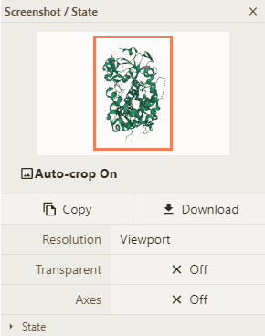

**Images & Movies**

An important functionality of Mol\* is the preparation of publication-ready outputs - images or animations 
#### **Image**

Clicking on the toggle Menu in the central top corner you can select the properties of the Image output via . Output image properties can be later selected - Cropping, Resolution (from Viewport, to UltraHD 3840x2160), Transparence, and presence of axes. Other Settings about views such as Camera, Ligthning and Clipping can be set in Settings/Control 
#### **Animation**
It is also possible to export animation to mp4 format. Clicking on the Control Panel next to to the Export Animation. Select animation type and time properties and finally click on the button Render.

Based on the [RCSB PDB mol* documentation](https://www.rcsb.org/3d-view/molstar/help/getting-started) thanks to the generosity of RCSB PDB and Dr. Shuchismita Dutta.
