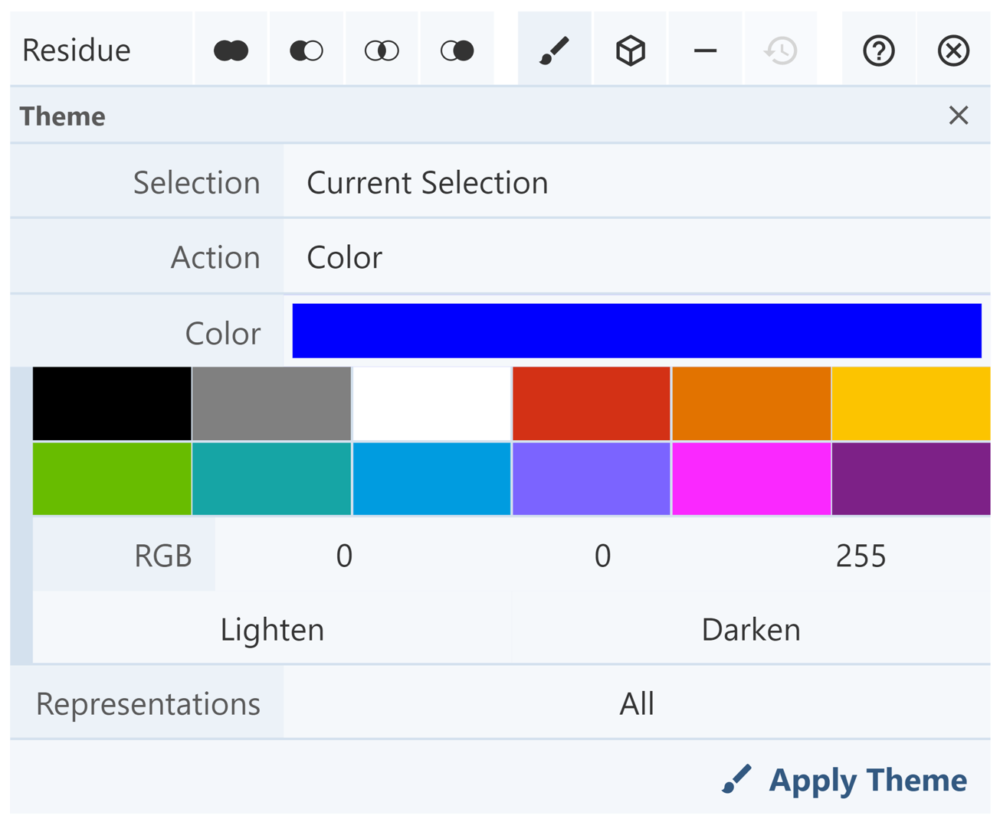
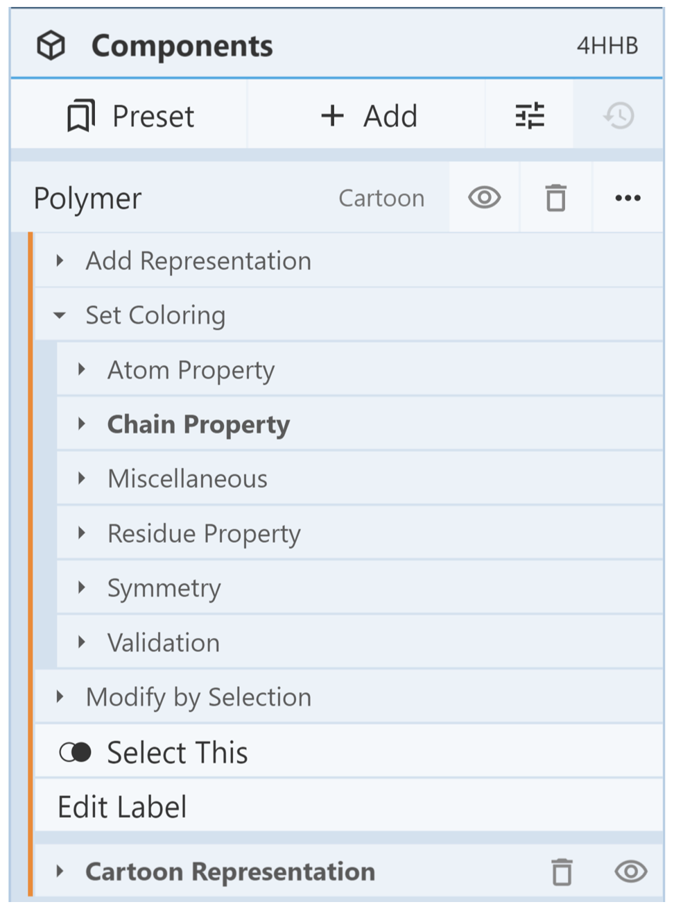
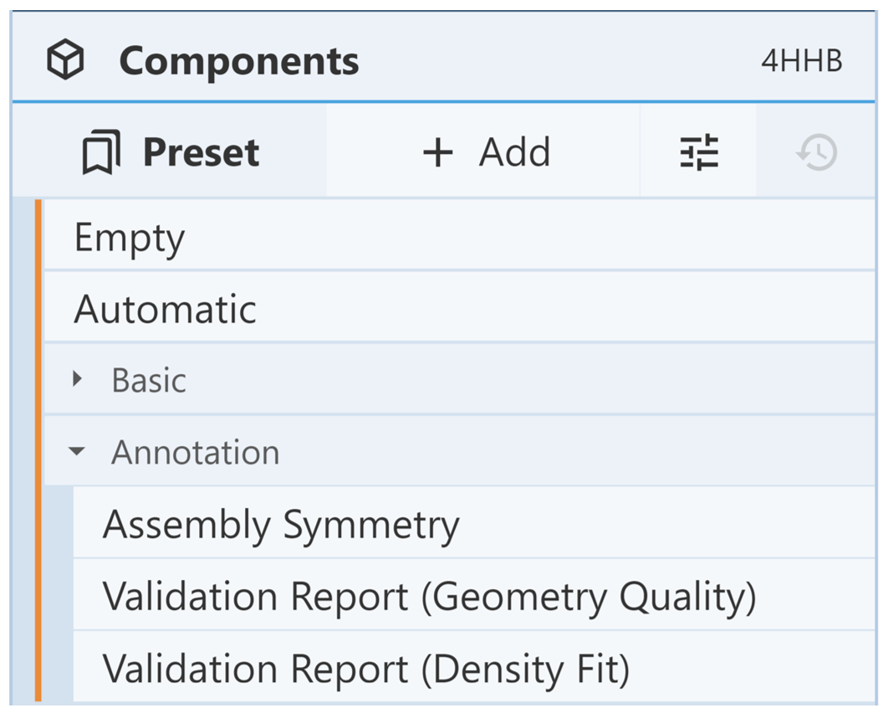
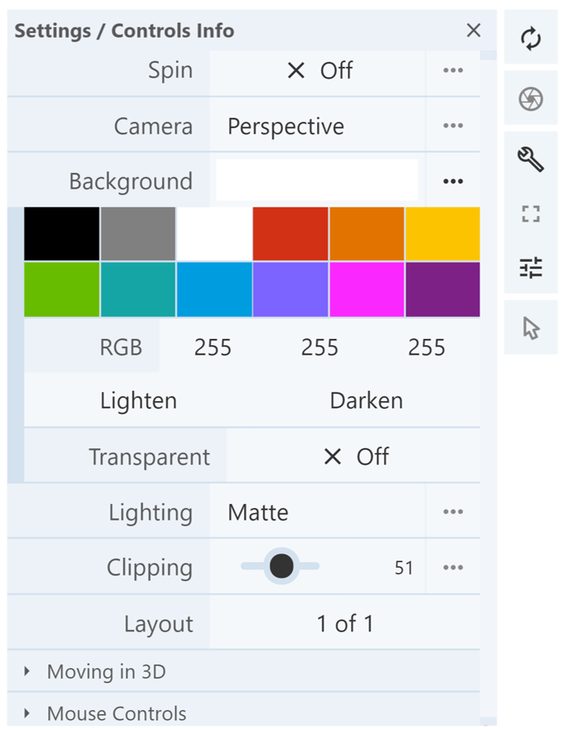
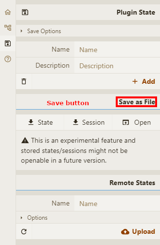

**Common Actions**
#### **Color**
There are three ways to color structures using Mol\*.

**1. Color using Selection Mode:** this method is best when seeking to apply a custom color to a structure. Select the parts of the structure to be colored in Selection Mode, and then the Apply Theme to Selection button (paint brush icon) located in the Selection Mode toolbar. Choose a desired color using the preset colors or create a new color using the RGB tool or the Lighten/Darken buttons. When appropriate color(s) have been selected, click Apply Theme. This tool can also be used to reset the color of the selection.

**2. Color using the Components Panel:** this method is best when seeking to apply a color based on structural properties. Create a component for the part of the structure to be colored. Click on the button containing three dots in the [Components Panel](managing-the-display.md#components-panel), and then click on the Set Coloring option. There are several submenus which allow the component to be colored according to its structural properties. For example, it can be colored based on chain ID (rainbow from N-terminus to C-terminus), hydrophobicity, secondary structure, etc.

**3. Color based on validation report:** click on the [Components Panel](managing-the-display.md#components-panel), then click on the Preset option. Select Annotation and click on one of the three options:

- **Assembly symmetry:** colors structure based on assembly symmetry cluster membership.
- **Validation report (geometry quality):** colors structure based on geometry quality and shows geometry clashes.
- **Validation report (density fit):** colors structure based on density fit.

There is one way to color backgrounds in Mol\*. Click on the Settings/Controls Information button in the Toggle Menu. Next to the Background option, choose a desired color using the preset colors, or create a new color using the RGB tool or the Lighten/Darken buttons. If the three dots next to the Background option are clicked, an option is provided to make the background transparent.

#### **Transparency**
To change the transparency of a representation and surface, part of the structure must first be selected using [Selection Mode](making-selections.md#selection-mode). Click on the Apply Theme to Selection button located in the Selection Mode toolbar. Next to Action, change the command to Transparency. Then use the Value slide to set the transparency of the selected structure. A value of 0 is completely opaque, and a value of 100 is completely transparent. Click Apply Theme when the desired value is chosen.

#### **Clip Planes**
Clipping cuts or slices away parts of structures, surfaces, and objects from view. There are two ways to manually change the clipping planes using Mol\*.

1. Use Shift + Mouse Wheel to move the front and back clipping planes. On a touchpad, use Shift + two-finger drag.
1. Use the settings button and the clipping slider

[Focusing](maneuvering-in-mol_.md#focus) on an object will automatically change the clipping planes to display the object of interest.

#### **Session/State saving**
Molstar can save individual sessions or states. 

In Plugin State you can save the actual state or session of the view as a .molj or .molx files State only saves an overall description of current view in JSON-like .molj file, but the input data are not downloaded and only linked from their original source. This option does not work for local input data. Saving a session stores not only the description, but also input data in binary .molx file. Name and description can be added to the save. 

Sessions/states can be opened either from local file or from remote location (e.g. stored on server) 

Based on the [RCSB PDB mol* documentation](https://www.rcsb.org/3d-view/molstar/help/getting-started) thanks to the generosity of RCSB PDB and Dr. Shuchismita Dutta.
