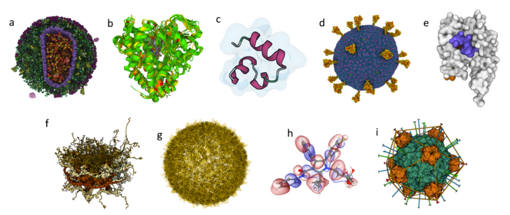

**Examples**

![Practical demonstrations of Mol\* Viewer visualization capabilities.]

We prepared several use cases that can be accessed from the Mol\* web page (<https://molstar.org>): 

1. [Enveloped HIV capsid in a blood serum](https://molstar.org/viewer/?snapshot-url=https%3A%2F%2Fmolstar.org%2Fdemos%2Fstates%2Fhiv-simple-cut.molx&snapshot-url-type=molx): originates from CellPack and includes more than 13 million atoms.
1. [Superimposition of cytochromes P450](https://molstar.org/viewer/?snapshot-url=https%3A%2F%2Fmolstar.org%2Fdemos%2Fstates%2Fcytochromes.molx&snapshot-url-type=molx): the superimposed structures are colored according to a structure quality annotation, based on wwPDB validation reports. 
1. [Villin un/folding simulation](https://molstar.org/viewer/?snapshot-url=https%3A%2F%2Fmolstar.org%2Fdemos%2Fstates%2Fvillin-md.molx&snapshot-url-type=molx): Part of a set of molecular dynamics trajectories for Markov state model analysis along villin headpiece folding and unfolding pathways. ([doi.org/10.6084/m9.figshare.12040257.v1](https://doi.org/10.6084/m9.figshare.12040257.v1) and <https://pubs.acs.org/doi/full/10.1021/acs.jctc.6b00049>)
1. [SARS-CoV-2 Virion](https://molstar.org/viewer/?snapshot-url=https%3A%2F%2Fmolstar.org%2Fdemos%2Fstates%2Fsars-cov-2_virion.molx&snapshot-url-type=molx): Coarse-grained model composed of glycosylated S-proteins, M-proteins, E-proteins, and a lipid bilayer (<https://dx.doi.org/10.1016%2Fj.bpj.2020.10.048>).
1. [GAIN domain tethered agonist exposure simulation](https://molstar.org/viewer/?snapshot-url=https%3A%2F%2Fmolstar.org%2Fdemos%2Fstates%2Fgain-md.molx&snapshot-url-type=molx): Molecular dynamics trajectory ([doi.org/10.1016/j.molcel.2020.12.042](https://doi.org/10.1016/j.molcel.2020.12.042)).
1. [Nuclear pore complex](https://molstar.org/viewer/?snapshot-url=https%3A%2F%2Fmolstar.org%2Fdemos%2Fstates%2Fnpc.molx&snapshot-url-type=molx): hybrid model originating from PDB-DEV and including 238,288 unique residues.
1. [Zika virus assembly including its Cryo-EM density](https://molstar.org/viewer/?snapshot-url=https%3A%2F%2Fmolstar.org%2Fdemos%2Fstates%2Fzikaem.molx&snapshot-url-type=molx): The original size of the data is about 1.6 GB.
1. [Molecular orbitals and electron density of atorvastatin](https://molstar.org/demos/alpha-orbitals/): a visualization of molecular orbitals and the electron density computed locally on a GPU from the provided basis and eigenvectors.
1. [DNA binding protein assembly](https://molstar.org/viewer/?snapshot-url=https%3A%2F%2Fmolstar.org%2Fdemos%2Fstates%2F1rb8asm.molx&snapshot-url-type=molx): a protein assembly showcasing the RCSB PDB assembly symmetry annotation.

Based on the [RCSB PDB mol* documentation](https://www.rcsb.org/3d-view/molstar/help/getting-started) thanks to the generosity of RCSB PDB and Dr. Shuchismita Dutta.
