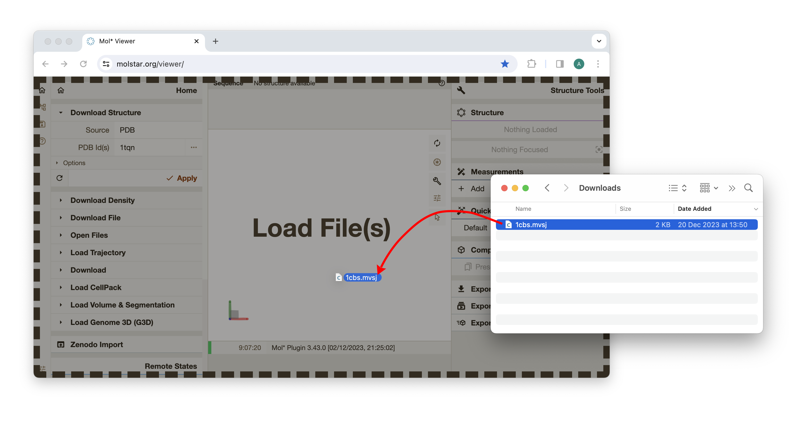

# MolViewSpec extension

**MolViewSpec (MVS)** is a tool for standardized description of reproducible molecular visualizations shareable across software applications.

MolViewSpec provides a generic description of typical visual scenes that may occur as part of molecular visualizations. A tree format allows the composition of complex scene descriptors by combining reoccurring nodes that serve as building blocks.

## More sources:

- [Developer documentation for Mol\* MolViewSpec extension](https://github.com/molstar/molstar/blob/master/docs/extensions/mvs/README.md)
- [MolViewSpec home page](https://molstar.org/mol-view-spec/)
- [Python library `molviewspec` for building MolViewSpec views](https://pypi.org/project/molviewspec/)
- [Python library `molviewspec` in action](https://colab.research.google.com/drive/1O2TldXlS01s-YgkD9gy87vWsfCBTYuz9)

## MolViewSpec data structure

MolViewSpec is based on a tree format, i.e. a molecular view is described as a tree where individual node types represent common data operations needed to create the view (e.g. download, parse, color). A MolViewSpec tree can be stored in `.mvsj` file format. Refer to the [developer documentation](https://github.com/molstar/molstar/blob/master/docs/extensions/mvs/README.md) for more details or see a few examples [here](https://github.com/molstar/molstar/tree/master/examples/mvs).

## MolViewSpec extension in Mol\* Viewer

There are multiple ways to load MolViewSpec views (`.mvsj` files) into Mol\* Viewer:

- **Drag&drop support:** The easiest way to load a MVS view is to drag a `.mvsj` file and drop it in a browser window with Mol\* Viewer. 

    Test with this file: [1cbs.mvsj](https://raw.githubusercontent.com/molstar/molstar/master/examples/mvs/1cbs.mvsj) (make sure to save it with `.mvsj` extension, not `.txt`)
  
    

- **Load via menu:** Another way to load a MVS view is to use "Download File" or "Open Files" action, available in the "Home" tab in the left panel. For these actions, the "Format" parameter must be set to "MVSJ" (in the "Miscellaneous" category) or "Auto".
    
    Test with this URL: https://raw.githubusercontent.com/molstar/molstar/master/examples/mvs/1cbs.mvsj

    

    

- **URL parameters:** Mol\* Viewer supports `mvs-url`, `mvs-data`, and `mvs-format` URL parameters to specify a MVS view to be loaded when the viewer is initialized.
    - `mvs-url` specifies the address from which the MVS view should be retrieved.
    - `mvs-data` specifies the MVS view data directly. Keep in mind that some characters must be escaped to be used in the URL. Also beware that URLs longer than 2000 character may not work in all browsers.
    - `mvs-format` specifies the format of the MVS view data (from `mvs-url` or `mvs-data`). The only allowed (and default) value is `mvsj`, as this is currently the only supported format. 
  
    Examples of URL parameter usage:

    - `mvs-url`: 
  
        <https://molstar.org/viewer?mvs-format=mvsj&mvs-url=https://raw.githubusercontent.com/molstar/molstar/master/examples/mvs/1cbs.mvsj>

    - `mvs-data`: 
    
        <https://molstar.org/viewer?mvs-format=mvsj&mvs-data=%7B%22metadata%22%3A%7B%22title%22%3A%22Example%20MolViewSpec%20-%201cbs%20with%20labelled%20protein%20and%20ligand%22%2C%22version%22%3A%221%22%2C%22timestamp%22%3A%222023-11-24T10%3A38%3A17.483%22%7D%2C%22root%22%3A%7B%22kind%22%3A%22root%22%2C%22children%22%3A%5B%7B%22kind%22%3A%22download%22%2C%22params%22%3A%7B%22url%22%3A%22https%3A//www.ebi.ac.uk/pdbe/entry-files/1cbs.bcif%22%7D%2C%22children%22%3A%5B%7B%22kind%22%3A%22parse%22%2C%22params%22%3A%7B%22format%22%3A%22bcif%22%7D%2C%22children%22%3A%5B%7B%22kind%22%3A%22structure%22%2C%22params%22%3A%7B%22type%22%3A%22model%22%7D%2C%22children%22%3A%5B%7B%22kind%22%3A%22component%22%2C%22params%22%3A%7B%22selector%22%3A%22polymer%22%7D%2C%22children%22%3A%5B%7B%22kind%22%3A%22representation%22%2C%22params%22%3A%7B%22type%22%3A%22cartoon%22%7D%2C%22children%22%3A%5B%7B%22kind%22%3A%22color%22%2C%22params%22%3A%7B%22color%22%3A%22green%22%7D%7D%2C%7B%22kind%22%3A%22color%22%2C%22params%22%3A%7B%22selector%22%3A%7B%22label_asym_id%22%3A%22A%22%2C%22beg_label_seq_id%22%3A1%2C%22end_label_seq_id%22%3A50%7D%2C%22color%22%3A%22%236688ff%22%7D%7D%5D%7D%2C%7B%22kind%22%3A%22label%22%2C%22params%22%3A%7B%22text%22%3A%22Protein%22%7D%7D%5D%7D%2C%7B%22kind%22%3A%22component%22%2C%22params%22%3A%7B%22selector%22%3A%22ligand%22%7D%2C%22children%22%3A%5B%7B%22kind%22%3A%22representation%22%2C%22params%22%3A%7B%22type%22%3A%22ball_and_stick%22%7D%2C%22children%22%3A%5B%7B%22kind%22%3A%22color%22%2C%22params%22%3A%7B%22color%22%3A%22%23cc3399%22%7D%7D%5D%7D%2C%7B%22kind%22%3A%22label%22%2C%22params%22%3A%7B%22text%22%3A%22Retinoic%20Acid%22%7D%7D%5D%7D%5D%7D%5D%7D%5D%7D%2C%7B%22kind%22%3A%22canvas%22%2C%22params%22%3A%7B%22background_color%22%3A%22%23ffffee%22%7D%7D%2C%7B%22kind%22%3A%22camera%22%2C%22params%22%3A%7B%22target%22%3A%5B17%2C21%2C27%5D%2C%22position%22%3A%5B41%2C34%2C69%5D%2C%22up%22%3A%5B-0.129%2C0.966%2C-0.224%5D%7D%7D%5D%7D%7D>
