**FAQs/Scenarios**
#### **How do I navigate the 3D canvas using a mouse, touchpad, or touchscreen?**
To rotate the structure, click the left mouse button and move. Alternatively, use the Shift button + left mouse button and drag.

To translate the structure, click the right mouse button and move. Alternatively, use the Control button + the left mouse button and move. On a touchscreen device, use a two-finger drag.

To zoom in or out, use the mouse wheel. On a touchpad, use a two-finger drag. On a touchscreen device, pinch two fingers.

To zoom in and center on a part of a structure, use the right mouse button to click onto the part of the structure you wish to focus on.

To change the clipping planes, use the Shift button + the mouse wheel. On a touchpad, use the Shift button + a two-finger drag.
#### **How do I make selections?**
There are several ways to make selections in Mol\*. You first need to open [Selection Mode](making-selections.md#selection-mode) and change the [Picking Level](making-selections.md#picking-level), if needed. To make selections, you can either click on parts of the structure in the 3D canvas or [Sequence Panel](navigating-by-sequence.md#sequence-panel), or use the Set Operations Menus in the Selection Mode toolbar.
#### **What are the four buttons with overlapping circles in the Selection Mode toolbar?**
The four buttons are used to modify a current selection with a new selection. The Add/Union button takes the current selection and adds a new selection to it. The Subtract/Remove button takes the current selection and removes the parts of it that are in a new selection. The Intersect button takes the current selection and selects the parts of it that are in the new selection. The Set button takes the current selection and replaces it entirely with a new selection.

For example, suppose all leucine residues are selected in a structure. A user then uses each button in the toolbar and clicks the “helices” option. For the Add/Union button, Mol\* will select all leucine residues and all helices. For the Subtract/Remove button, Mol\* will select all leucine residues not in helices. For the Intersect button, Mol\* will select all leucine residues in helices. For the Set button and selects helices, Mol\* will select all helices.
#### **How do I select by secondary structures?**
If you want to select only secondary structures (alpha helices and beta strands/sheets), there are options to do this in the Selection Mode toolbar. Go to Set Selection, then click Structure Property. At this point you can choose either Helix or Beta Strand/Sheet to select either.
#### **How do I invert my selection?**
After making a selection of the region you want to exclude from the selection, click the Set Selection button in the Selection Mode toolbar. Under this menu, choose Manipulate Selection, then choose Inverse/Complement of Selection.
#### **How do I select a specific type of amino acid throughout the structure?**
Within the Selection Mode toolbar, go to Set Selection, and under Amino Acid, choose the amino acid you would like to select. For example, to select all histidine residues, click on “Set Selection” then scroll down to Amino Acid and click on “Histidine (HIS).”
#### **How can I replace which sequence is shown in the Sequence Panel?**
There are three drop-down menus in the [Sequence Panel](navigating-by-sequence.md#sequence-panel). The leftmost menu allows you to decide which PDB structure the new sequence should be from. The centermost menu allows you to decide which entity the new sequence should be from. The rightmost menu allows you to decide which part of the entity the new sequence should be from (if the entity contains duplicate copies).
#### **How do I switch between different models and biological assemblies for display in the 3D canvas?**
Go to the Controls Panel and to the [Structure Panel](managing-the-display.md#structure-panel). Clicking the presets button will show various structure presets (default, unit cell, super cell). Click next to Type to choose between the various models and assemblies available.
#### **How do I color a structure by the rainbow/spectrum color scheme?** 
To color an entire structure from N-terminus to C-terminus as a rainbow, go to Polymer under the [Components Panel](managing-the-display.md#components-panel). Click the Options button to the right, and select Set Coloring. Under this menu, select Residue Property, which will open another menu. Select Sequence Id. This will color each of the polymer chains from N- to C-terminus from blue to red color.
#### **How do I color based on chain?**
To color an entire structure based on chain, go to Polymer under the [Components Panel](managing-the-display.md#components-panel). Click the Options button to the right, and select Set Coloring. Under this menu, select Chain Property, which will open another menu. Select Chain Id. This will give each chain a different color.
#### **How do I color a structure based on hydrophobicity?**
To color an entire structure based on hydrophobicity, go to Polymer under the [Components Panel](managing-the-display.md#components-panel). Click the Options button to the right, and select Set Coloring. Under this menu, select Residue Property, which will open another menu. Select Hydrophobicity. Hydrophilic residues will be colored in shades of orange and hydrophobic residues will be colored in shades of green.
#### **How do I color a whole structure based on secondary structural elements (alpha helices and beta strands/sheets)?**
To color an entire structure based on secondary structural elements, go to Polymer under the [Components Panel](managing-the-display.md#components-panel). Click the Options button to the right, and select Set Coloring. Under this menu, select Residue Property, which will open another menu. Select Secondary Structure. Alpha helices will be colored pink, beta strands/sheets will be colored light orange, and all other residues will be colored while.
#### **How do I color a domain?**
To color a domain, use [Selection Mode](making-selections.md#selection-mode) to select the domain using either the [Sequence Panel](navigating-by-sequence.md#sequence-panel) or by clicking on the residues in the domain in the 3D canvas. Click the Apply Theme to Selection button and select a color. When done, click Apply Theme.
#### **How do I change the transparency of representations and surfaces?**
To change the transparency, select the whole structure or part of the structure using [Selection Mode](making-selections.md#selection-mode). Click the Apply Theme to Selection button and change the Action to Transparency. Use the Value slider to change the transparency and click Apply Theme to finish.
#### **How do I hide certain parts of a structure?**
If a component of that region does not already exist, make a selection of the region you wish to hide, and [create a component](managing-the-display.md#create-component) out of it. Go to the [Components Panel](managing-the-display.md#components-panel) and click the eye icon next to the component of choice to hide it. The component can be shown again by clicking the eye icon again.
#### **How do I change the representation of my structure?**
Depending on which part of the structure you want to change representation for, choose one of the components under the [Components Panel](managing-the-display.md#components-panel). If you want to change the representation for a selection and a component does not exist, [create a component](managing-the-display.md#create-component) from this selection. Select Options for the component of choice, and click Add Representation and choose the representation you desire.
#### **How do I show the surface of my structure?**
Go to the [Components Panel](managing-the-display.md#components-panel) and click Options for Polymer. Click Add Representation and select Gaussian Surface or Molecular Surface.
#### **How do I focus on part of a structure?**
There are several ways to focus on part of a structure. In default mode, click on a residue in the 3D canvas or in the [Sequence Panel](navigating-by-sequence.md#sequence-panel) to focus on it along with surrounding residues. Alternatively, click on an object listed in the [Components Panel](managing-the-display.md#components-panel) to focus on it. If an object is currently selected, click on it in the [Structure Panel](managing-the-display.md#structure-panel) to focus on it.
#### **How do I measure distances?**
Select two items that you want to measure the [distance](managing-the-display.md#distance) between. Go to the Measurements Panel, and select Add. Select Distance. The distance will be labeled in the 3D canvas and have a new menu under Controls.
#### **How do I measure angles?**
Select three items that you want to measure the [angle](managing-the-display.md#angles) between, making sure that the second selection is the vertex. Go to the Measurements Panel, and select Add. Select Angle. The angle will be labeled in the 3D canvas and have a new menu under Controls.
#### **How do I label my structure?**
Select an item that you want to [label](managing-the-display.md#labels). Go to the Measurements Panel, and select Add. Select Label. The label will be displayed in the 3D canvas and have a new menu under Controls.
#### **How do I compare/superpose multiple structures?**
The Superposition Panel allows for multiple structures to be superposed. First, visit [molstar.org/viewer](molstar.org/viewer/) and upload two or more structures. In order to superpose by chains, select two or more polymer chains/residues from multiple structures and click “Superpose” to superpose them. In order to superpose by atoms, select one or more atoms from multiple structures and click “Superpose” to superpose them.

The level of similarity between the selections in the two structures can be assessed by examining the superposed structures visually in the 3D canvas and also by monitoring the root-mean-square deviation (RMSD) displayed at the bottom of the page in the Log Panel.
#### **When would I use superposition to compare structures “by chains” and “by atoms?”**
There are advantages to superposing “by chains” and “by atoms.” For instance, superposing by chains is useful when seeking to align dissimilar structures. If the regions that need to be aligned are unknown, superposing by chains helps orient secondary structural elements in the 3D canvas. Another benefit of superposing by chains is aligning selected residues. This enables parts of chains (e.g., domains, active sites) to be aligned in multiple structures. In this example, the PDB IDs 6PVP and 6DVW are used. These structures represent open and closed state transient receptor proteins. It is possible to align the proteins by chain, which yields an RMSD of 3.35. When 34 residues from only one of the helices is selected from the same chain in each structure, an RMSD of 1.08 is recorded. This is a good method to reduce the RMSD.

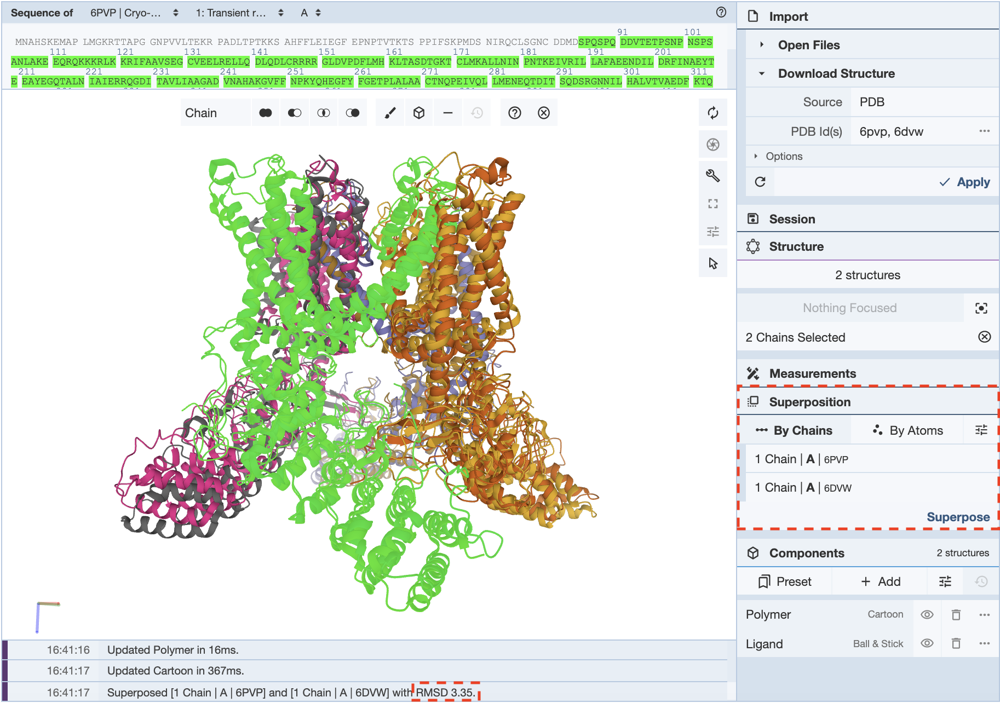

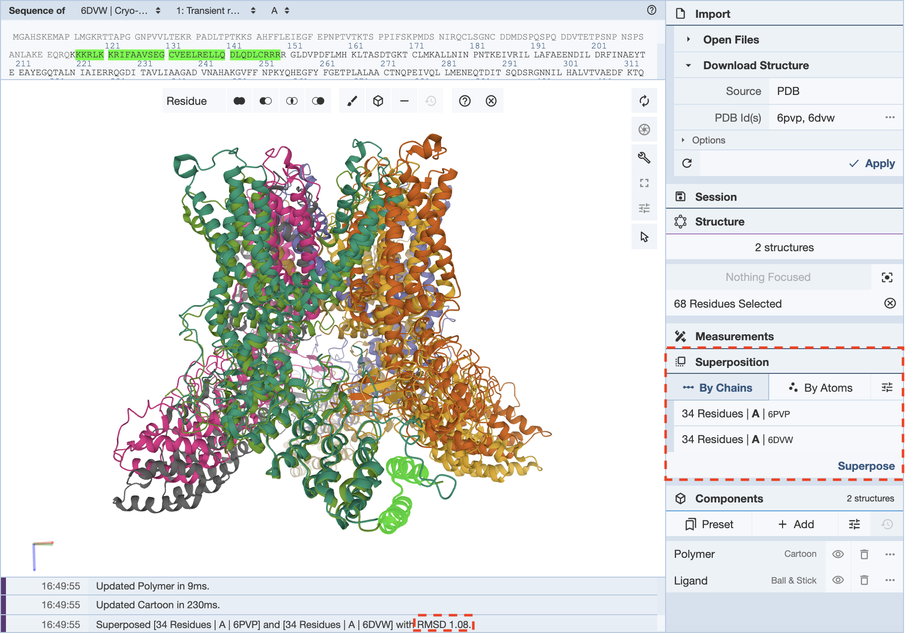

Superposing by atoms is helpful when looking at the orientations of a small molecule present in multiple structures.This is an example of where superposing structures by atoms is helpful: the antibiotic structures for actinomycin 1A7Y and 1A7Z. In this structure, the core atoms that remain the same were selected in the same order, and this superposition gives an RMSD value of 0.12.

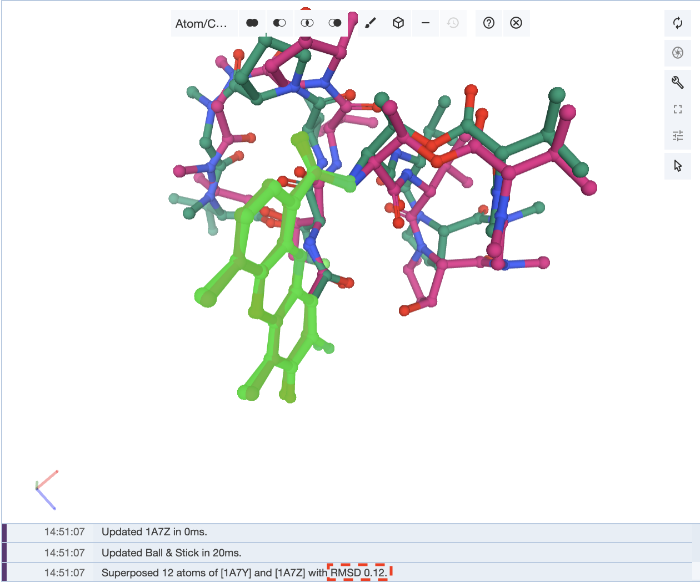

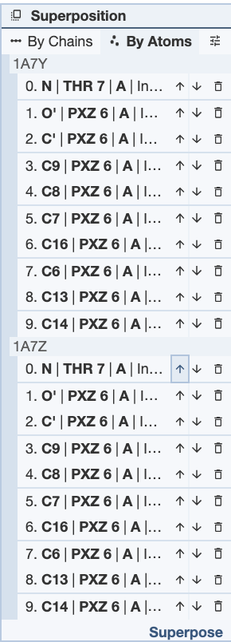
#### **How can I improve the RMSD value for my superposition?**
When superposing structures, an RMSD value is given that is calculated from the superposed regions. The lower the number the better the match between the regions compared. It is up to the user which regions they want to superpose, depending on their research question. However, there are a few ways to improve the superposition and RMSD value.

If you have superimposed your structures by chain, the RMSD value for that alignment may be large if some of the loops or termini of these structures are not well aligned.. In this case, it may be valuable to limit the selections to certain regions of the chains, such as secondary structures like alpha helices or beta sheets.

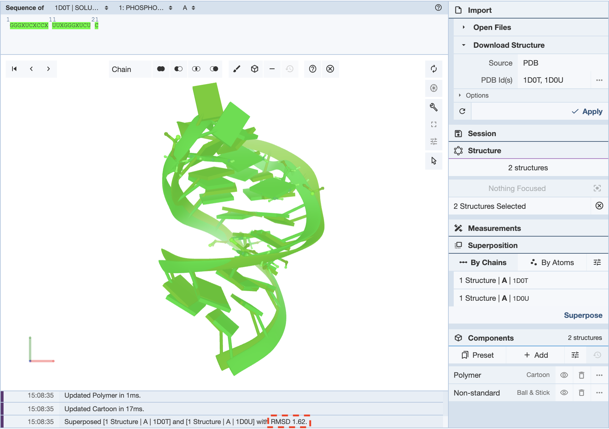

In this example, in a superposition of the structures 1D0T and 1D0U, the whole chain is selected for both structures to align them. This gives an RMSD value of 1.62.

Now, when only a portion of the sequence is selected to align the structures, an RMSD value of 1.41 is obtained.

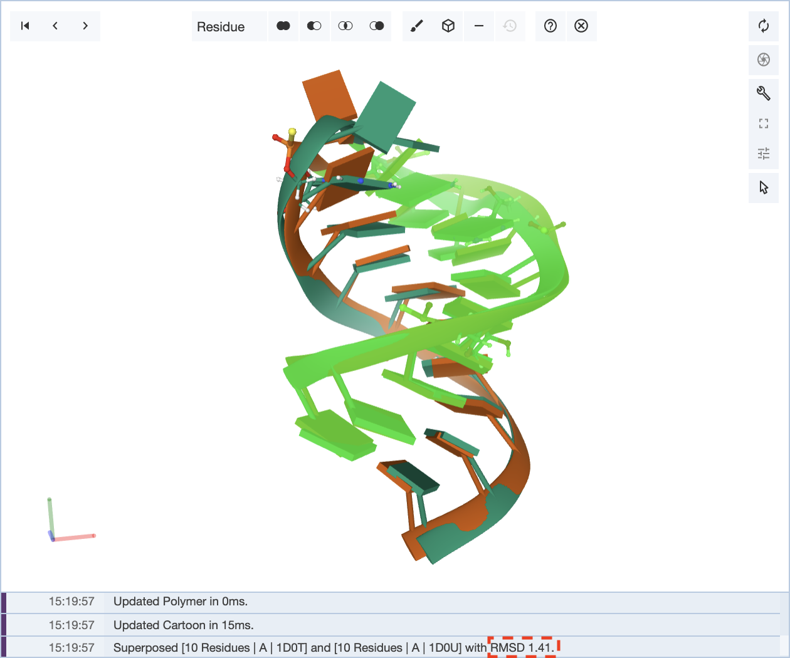

If you are superposing the structures by atoms, you can conduct a similar process. It is important to note that a lower RMSD value may not mean an overall better superposition. Again, it is up to the researcher to decide what they want to superpose.

Using the example of the structures 1A7Y and 1A7Z, if only three pairs of atoms are chosen to superpose the structures, an RMSD value of 0.01 is observed, but the rest of the structure is not as well aligned.

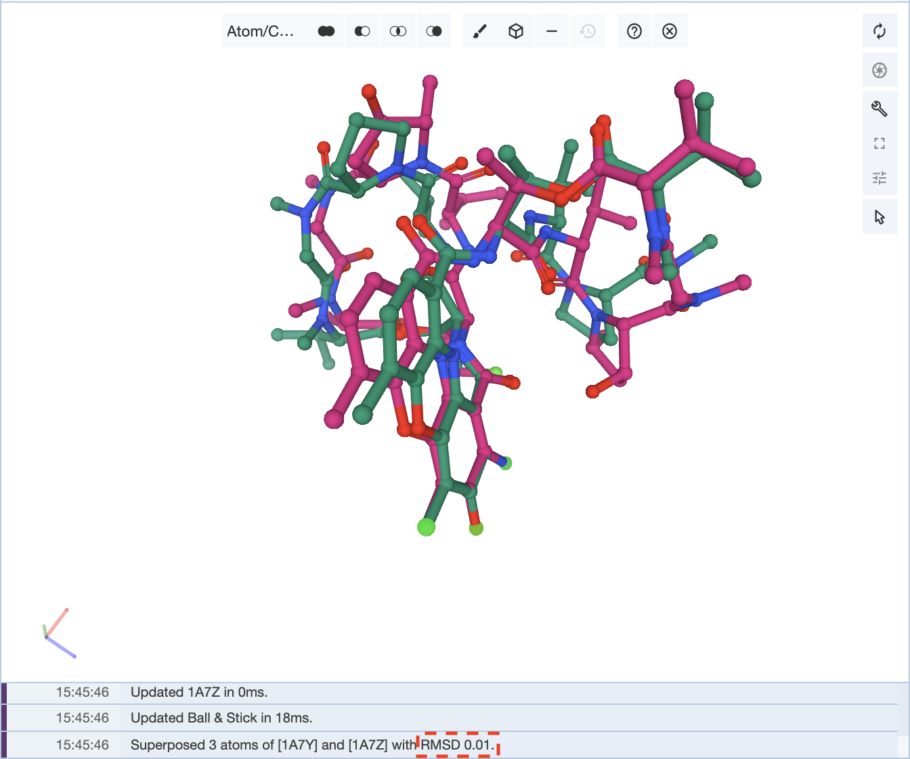

Now if we choose 6 pairs of atoms from across the molecule, then a higher RMSD value of 0.50 is obtained, but there is a neater overall alignment of the two structures.

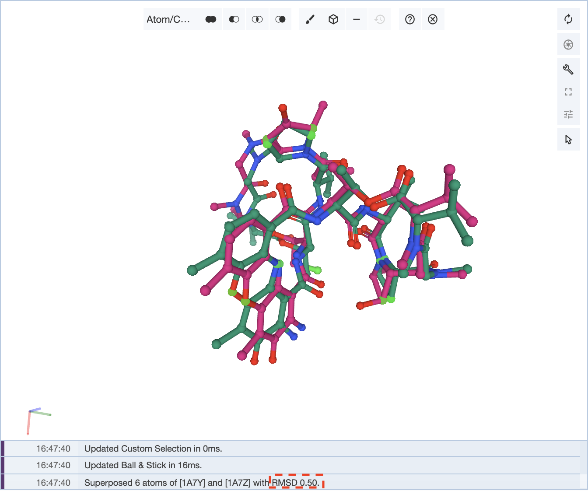

It is up to the user on how to optimize the superposition of the structures.
#### **How do I represent my ligand when it is a peptide-like molecule?**
Sometimes, when a structure is loaded, a portion of the structure may have multiple representations, and changing the representation doesn’t fix the problem. In this case, it is helpful to empty out all the preset components and create them again with the representation you desire. In this example, we will use the structure (6LU7) for the SARS-CoV-2 main protease with an inhibitor N3. When you pull up this structure, it shows the whole structure with the inhibitor as well.

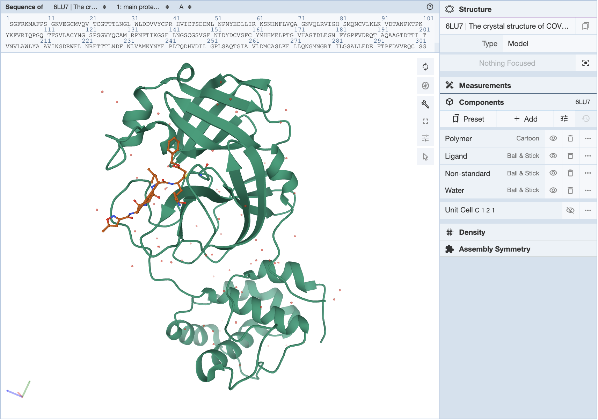

The inhibitor is shown in ball-and-stick form, as the Components Panel suggests, but there is also a cartoon backbone that is not hidden by trying to make the representation of the ligand ball-and-stick.

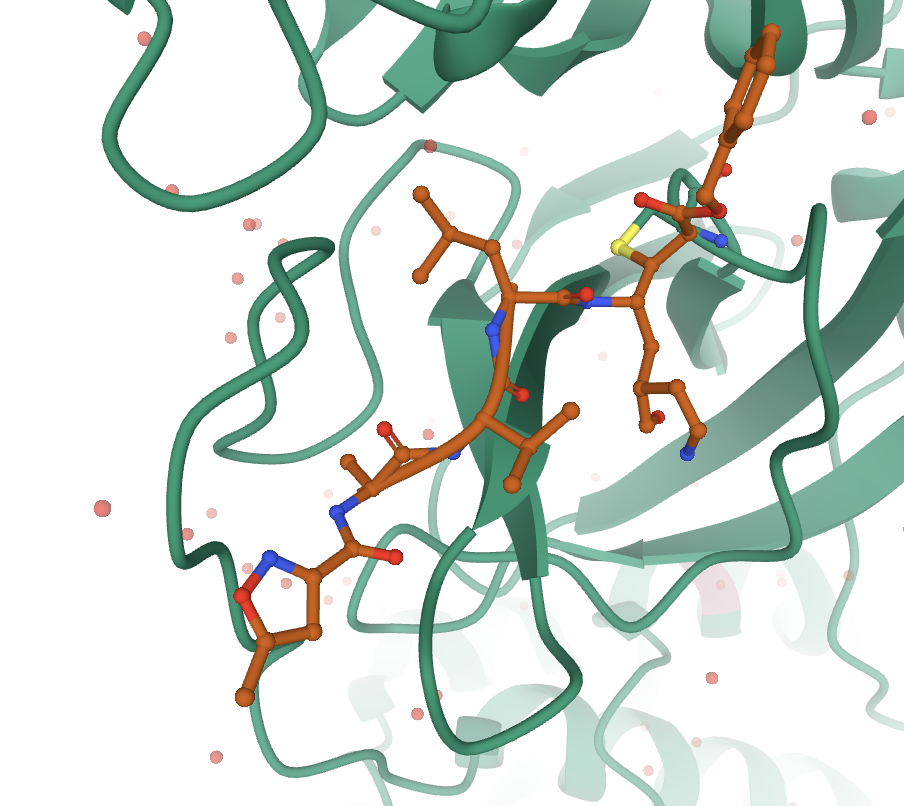

In this case, the best plan of action is to empty the preset components, and this clears the 3D canvas.

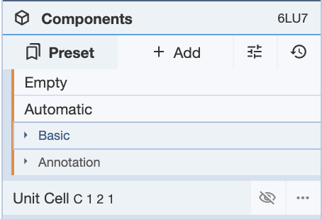

Then select the chain of whichever component you will be creating. In this case, I chose the ligand, and selected the chain in the Sequence Panel. Then create a component in the Selection Mode toolbar as shown below.

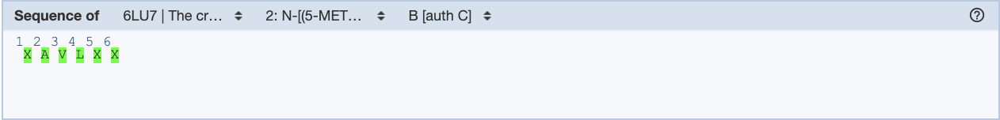

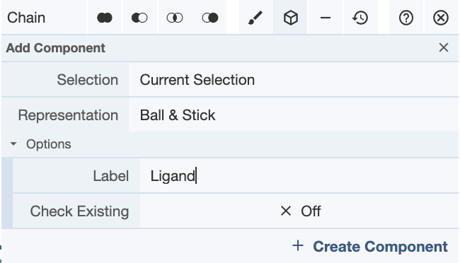

At this point the ligand shows in the 3D canvas as a ball-and-stick representation without the cartoon showing.

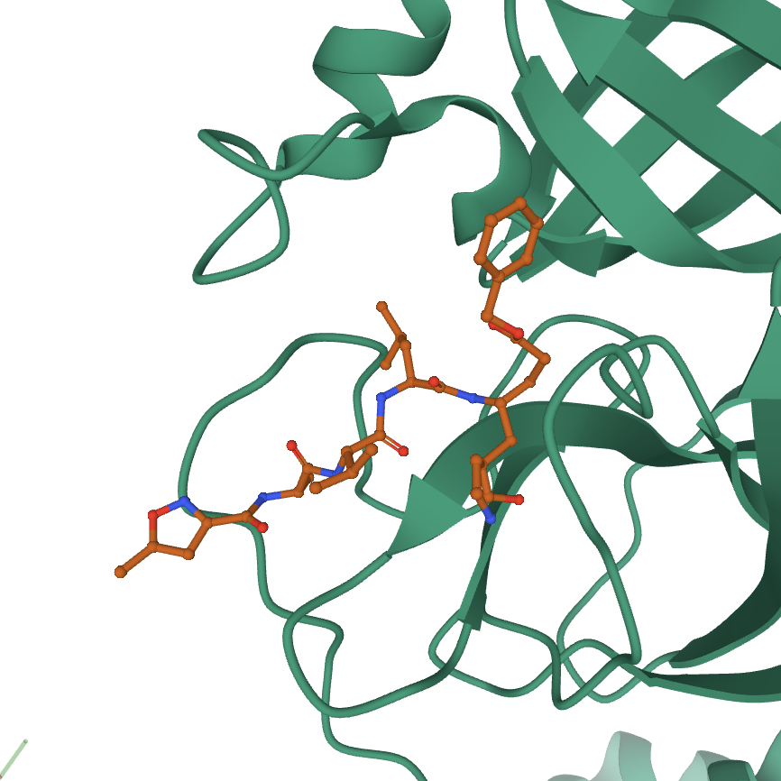

At this point, a covalent bond to a cysteine on the protein from the ligand does not show. There are a few ways to fix this. You can either zoom into the structure in default mode by focusing on the residues near this bond. You can also make a component of the residues involved in the bond, and show them using a ball-and-stick representation.
#### **How do I change the color or representation of one chain in the structure?**
The easiest way to do this is to make a component of the chain you are trying to change. In the Components Panel, you can then select the component of the chain to change its color or representation. For example, PDB structure 6lu7 depicts the main protease of SARS-CoV-2 with an inhibitor N3. The biological assembly contains two identical chains (which we will call chain A ASM\_1 and chain A ASM\_2). When this structure is opened in Mol\*, both chains are colored green and are shown in the ribbon representation. Suppose you wanted to show the molecular surface only chain A ASM\_1and color it based on hydrophobicity. The first step is to select the entirety of chain A ASM\_1 and create a component of it. To change the representation, open the components menu for the chain A ASM\_1 component (shown in a black box with a dashed line in the image below ). Use the Add Representation menu and click on “molecular surface.” The display should look like the following:

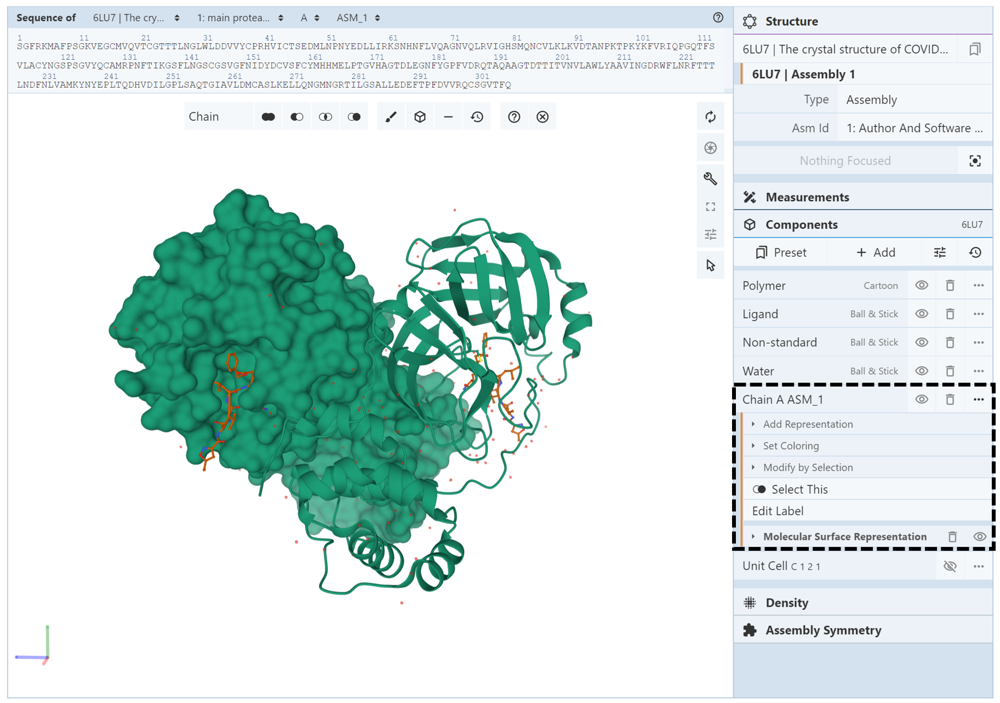

Next, we change the color of chain A ASM\_1 by opening up the components menu for the chain A ASM\_1 component and using the Set Coloring menu and click on “hydrophobicity.” As can be seen in the image below, the coloring and representation changes have been applied to only chain A ASM\_1 and not chain A ASM\_2.

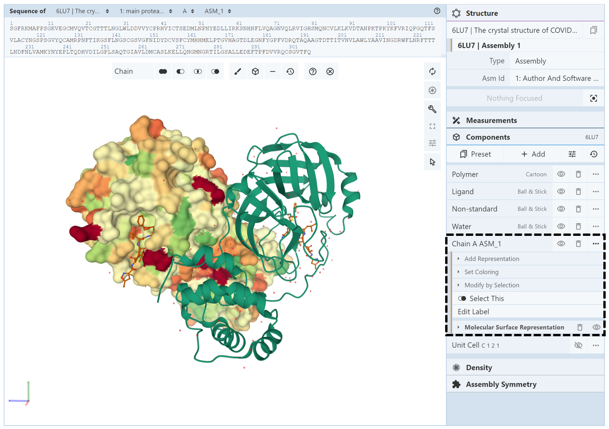
#### **How do I show hydrogen bonds (non-covalent interactions)?**
In order to show any non-covalent interactions, the components’ representations need to be adjusted. Non-covalent interactions is one of the representations available if you click Add Representation for any of the components. The non-covalent interactions that are shown can be modified using the options under the button next to Add in the [Components Panel](managing-the-display.md#components-panel). Once Non-covalent Interactions is clicked on, a drop-down menu will show the various non-covalent interactions that can be toggled on and off for viewing.

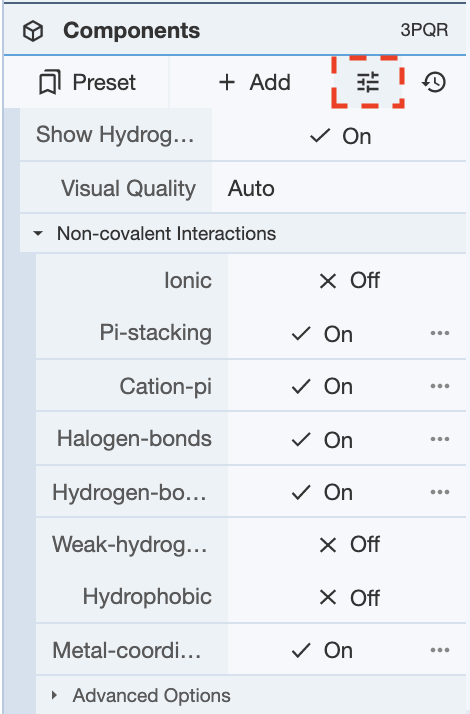

Once this is decided, non-covalent interactions can be added as a representation. For this example, non-covalent interactions for the entire polymer of 3PQR will be shown. For reference, the structure looks like this prior to adding representations to the cartoon representation of the polymer.

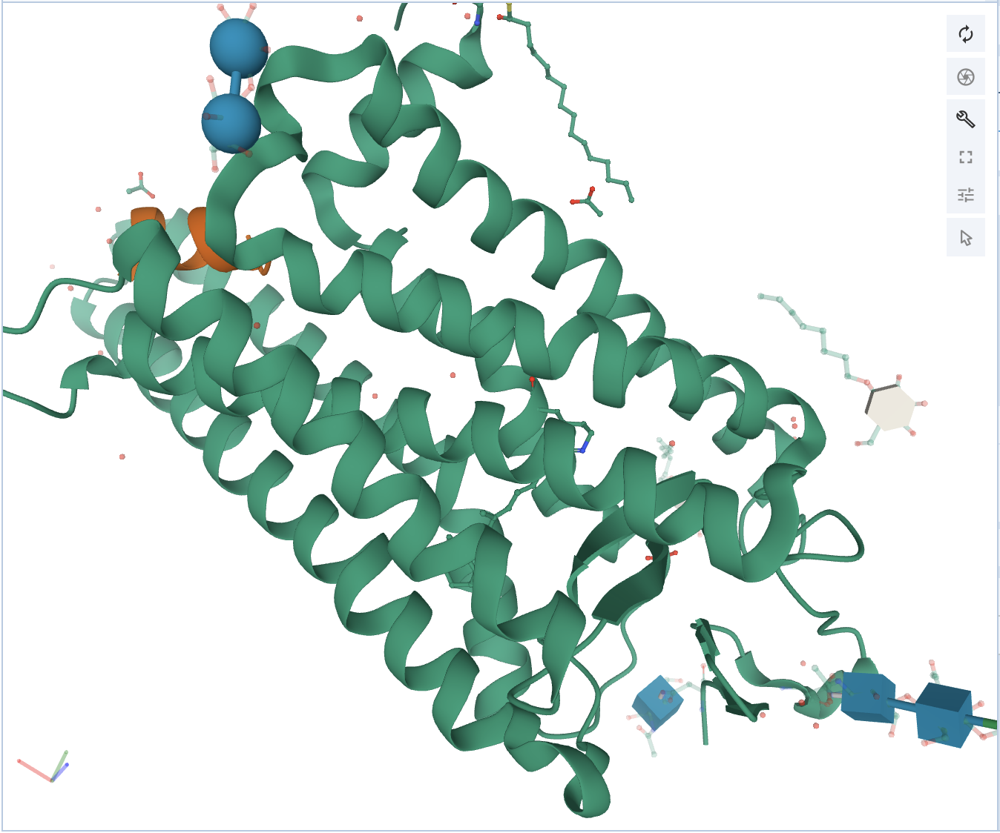

At this point, click on Polymer, and click Add Representation. To be able to visualize the atoms that are involved in the non-covalent interactions, turn on both the Ball & Stick and Non-covalent Interactions. Now there should be three representations, and the structure should look like this.

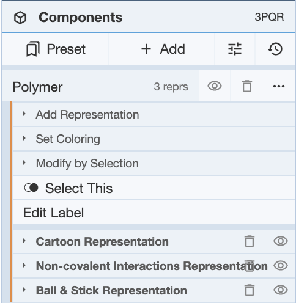

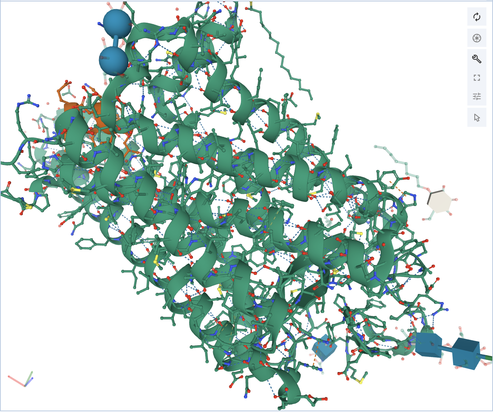

Now if you want to see what interaction is being shown, mouse over the interaction, and it will show in the bottom right corner of the 3D canvas.
#### **How do I tweak the hydrogen bond distance threshold?**
In order to change the parameters for hydrogen bonds, or any other non-covalent interactions, click on the Options button in the Components panel, and click on the options button for any of the interactions you want to tweak the parameters for. Once this is done, there are various options for tweaking the parameters. Clicking on the question mark for any of the options will give a short description of what that option is responsible for calculating.

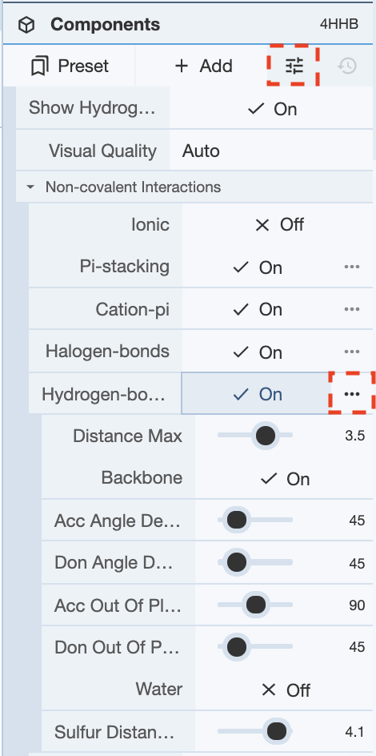
#### **How to display the interactions of a ligand with amino acids and ligands bound nearby?**
If you want to show the interactions nearby a ligand, including the hydrogen bonding and any other kinds of bonding, you need to focus on the target first. For example, if you want to show how a ligand binds to a protein, and you want to color the surrounding residues while showing the interactions, there are a set of steps to follow in a specific order.

First you need to focus on the target ligand. In this example, the structure 4HHB will be used. If you want to show the heme group and its interactions with the hemoglobin structure, first you need to focus on the heme group. Make sure you are in the default mode and click on the heme group in the 3D canvas. This will focus on the heme group and show the interactions with the residues around it.

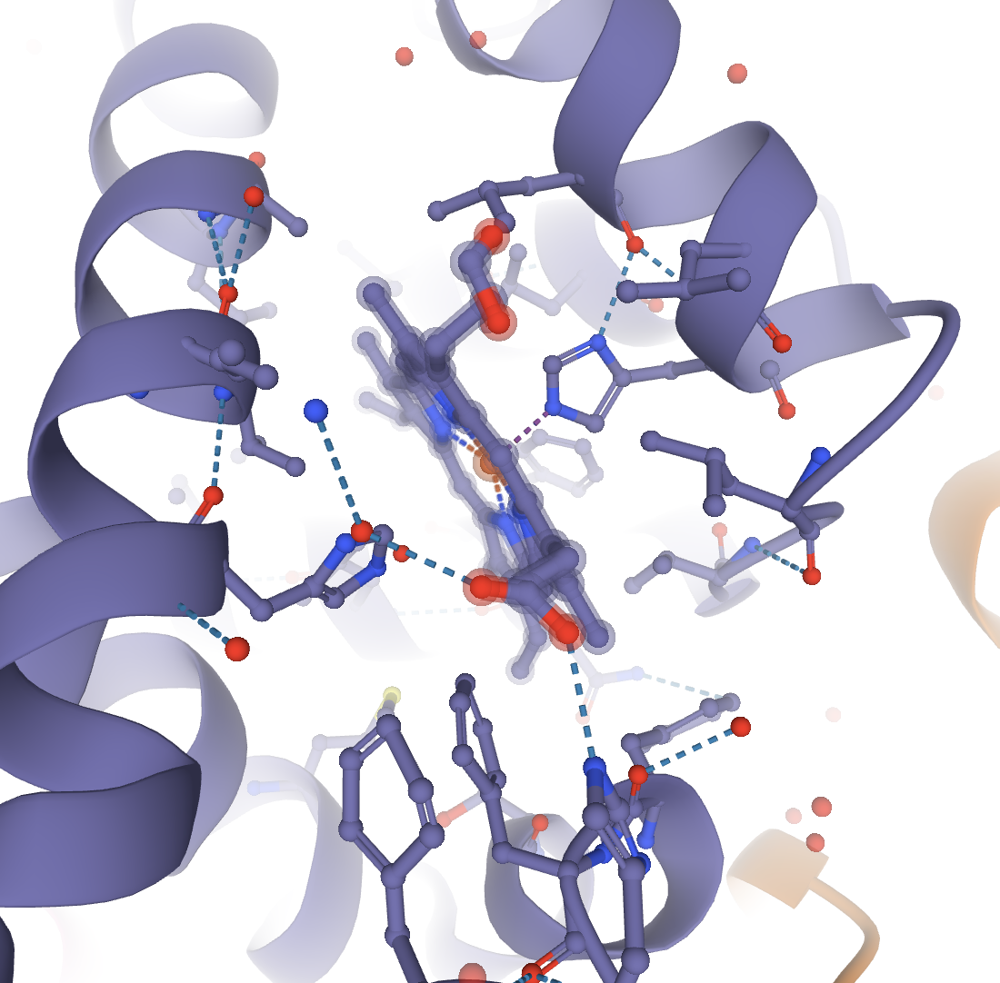

Now the interactions between the heme group and the protein are shown. If you click away from this, the structure will unfocus and go back to the starting display. You will need to focus again. To color the heme group one color and the surrounding residues a separate color, these are the steps that can be taken. In order to first color the heme group, you will need to select it. Click open the Selection Mode toolbar. Select the heme group by clicking on it in the 3D canvas. Now color it the desired color using the color tool in the Selection Mode toolbar, and clicking Apply Theme.

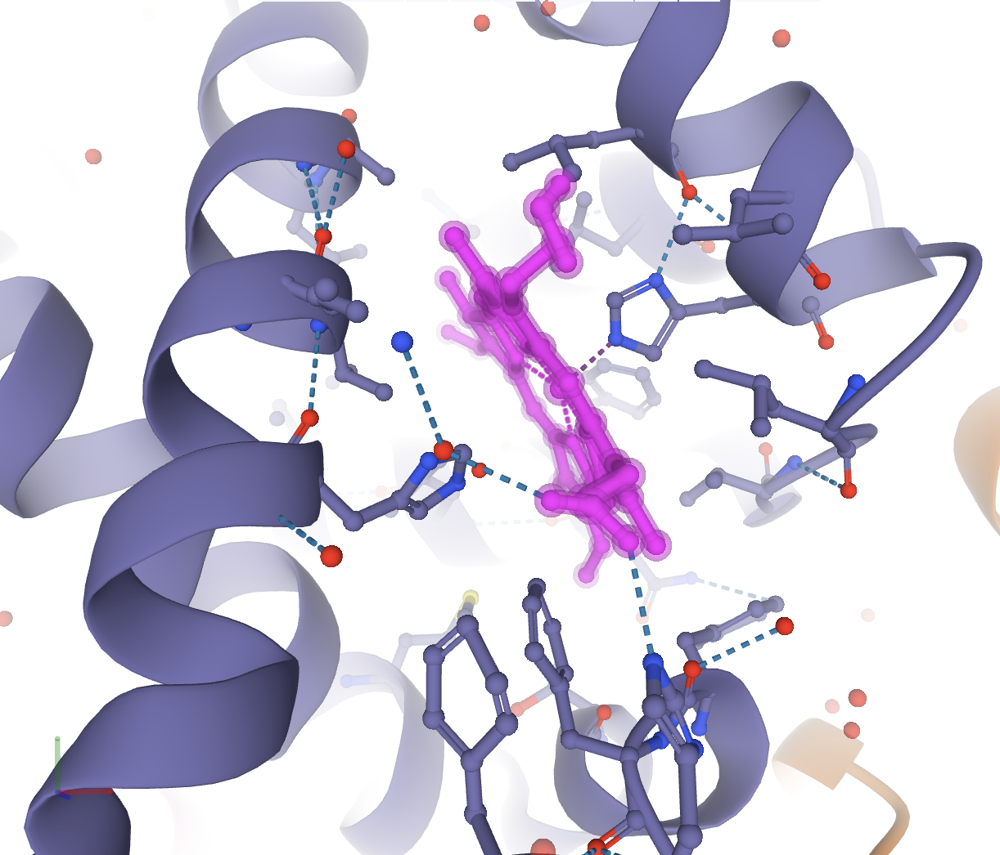

Now to invert the selection to the surrounding 5 Å of residues, in the Selection Mode toolbar, go to Set Selection, then Manipulate Selection, and choose Surrounding Residues (5 Å) of Selection. It should look like the following.

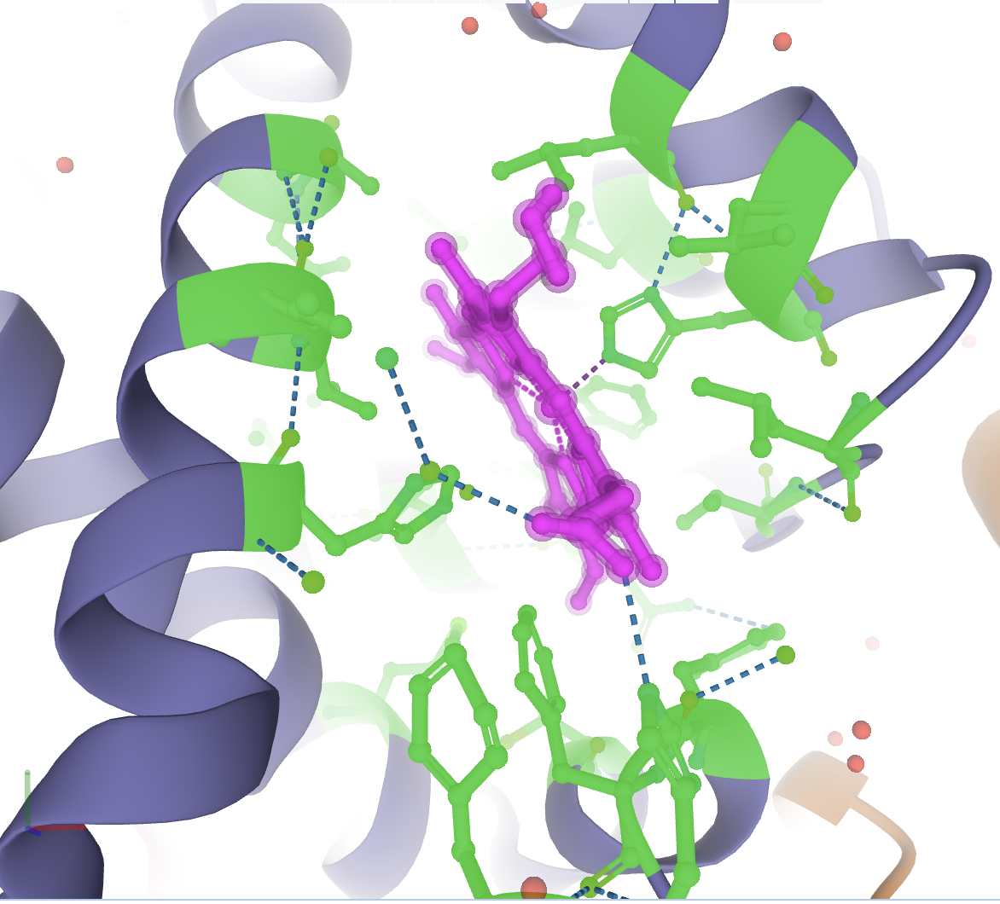

Now color this selection as before to the color of your choosing. If you deselect everything, you will see an image like the following.

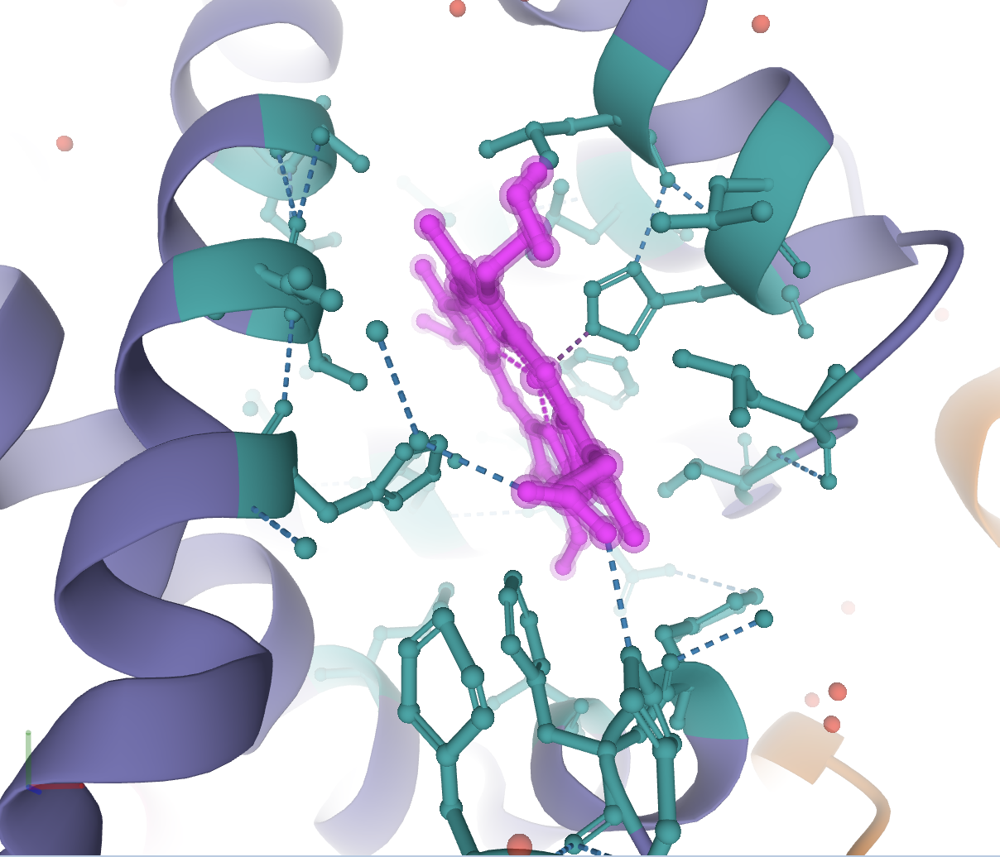

You can now save this image using the Screenshot / State Snapshot option in the toggle menu.
#### **If I have multiple structures uploaded, how can I toggle between the display of the structures?**
It can be tricky dealing with multiple structures. To make it simpler, it is important to know how to display only one structure at a time, and to be familiar with switching between which structure is displayed. After the structures are uploaded, you’ll need to use the Structure Panel and Components Panel to do this. In the example below, PDB structures 6lu7 (SARS-CoV-2 main protease bound by an inhibitor) and 6yb7 (SARS-CoV-2 main protease with an unliganded active site) were uploaded at rcsb.org/3D-view. A simple [superposition](managing-the-display.md#superposition-panel) using chain A ASM\_1 in each structure was performed to overlay the two structures. The Mol\* page should look like the following image, with 6lu7 shown in green and 6yb7 shown in purple:

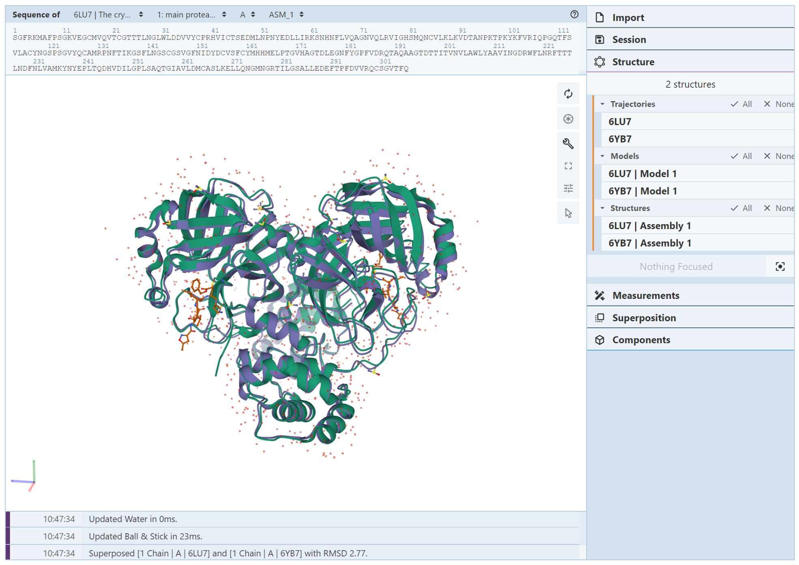

Next, we want to hide one of the structures while showing the other structure. Suppose the structure we want to hide is 6lu7. To do this, go into the Structure Panel and locate the Structures menu. This menu lists each structure uploaded into Mol\*. Clicking on one of the structures in this menu will show the components for just that structure in the Components Panel. We want to see the components for only 6lu7 so we can opt to hide them. In the Structures menu, click on “None” to deselect both structures, then click on “6LU7 | Assembly 1” to display its components. The Structures menu should look like the following image:

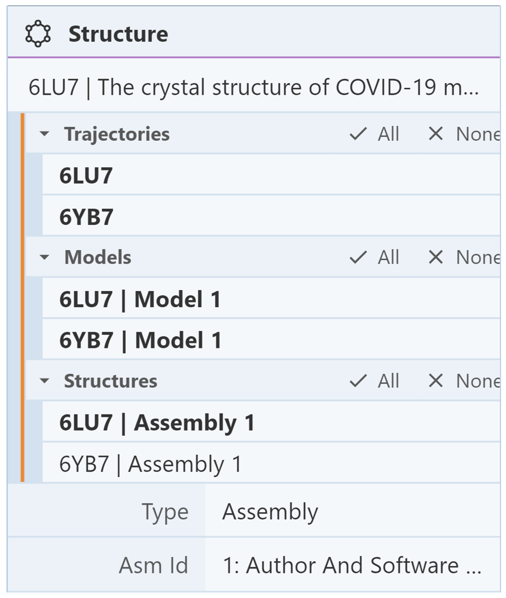

Then go to the Components Panel where it lists the components of only 6lu7. Click the “eye” icon to hide each component. In the 3D canvas, you should only see 6yb7.

Next, suppose we want to show 6lu7 and hide 6yb7. First, we need to reshow the components of 6lu7. To do this, go the Structures menu in the Structure Panel and select only 6lu7. Then, use the Components Panel to show the components of 6lu7. In the 3D canvas, you should see both structures. To hide 6yb7, use the Structures menu to select only 6yb. It should look like the following image:

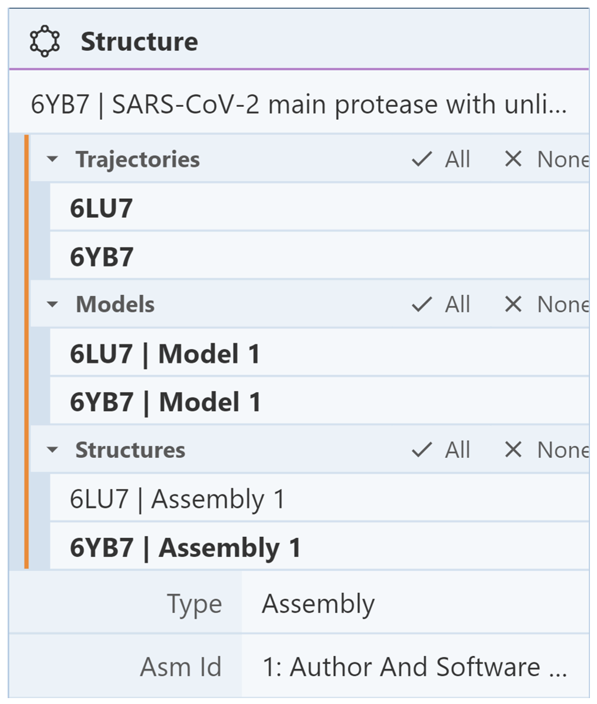

Then go to the Components Panel where it lists the components of only 6yb7. Click the “eye” icon to hide each component. In the 3D canvas, you should only see 6lu7.

Based on the [RCSB PDB mol* documentation](https://www.rcsb.org/3d-view/molstar/help/getting-started) thanks to the generosity of RCSB PDB and Dr. Shuchismita Dutta.
