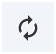

**Getting Started**
#### **General Interface**
The user interface is structured with the following components.

**3D Canvas**: This is the space where a PDB structure is displayed for manipulation in three dimensions (3D). It is located on the left side of the screen.

**Toggle Menu**: This menu provides users quick access to some commonly used operations for the 3D canvas. It is located towards the right side of the 3D canvas and has the following functions.

|**Function**|**Description**|**Icon**|
| :-: | :-: | :-: |
|*Reset Camera*|Centers and resets the view of the structure on the 3D canvas| |
|*Screenshot/State Snapshot*|Takes an image of the structure as shown and gives options for resolution and download| |
|*Controls Panel*|Hides/shows the Controls Panel to the right| |
|*Expanded Viewport*|Expands 3D canvas and Controls Panel to the full browser screen| |
|*Settings/Control Info*|Provides settings for viewing of 3D canvas, as well as information about moving in 3D and mouse controls| |
|[*Selection Mode*](making-selections.md#selection-mode)|Switches from [Default Mode](index.md#default-mode) to Selection Mode| |
[**Sequence Panel**](navigating-by-sequence.md#sequence-panel): This menu displays the polymer sequences of macromolecules (proteins and nucleic acids) present in the uploaded PDB structures. In addition, it provides quick access to any small molecular ligands or entities present in the structure(s). It is located at the top of the screen above the 3D Canvas.

[**Controls Panel**](managing-the-display.md#controls-panel): This menu has the following panels for structure manipulation. It is located at the right side of the screen.

- [Structure](managing-the-display.md#structure-panel)
- [Measurements](managing-the-display.md#measurements-panel)
- [Components](managing-the-display.md#components-panel)
- [Density](managing-the-display.md#density-panel)
- [Assembly Symmetry](managing-the-display.md#assembly-symmetry-panel)
- [Import](managing-the-display.md#import-panel)
- [Session](managing-the-display.md#session-panel)
- [Superposition](managing-the-display.md#superposition-panel)

**Log Panel**: This panel shows various logs containing information about actions taken while viewing the structure. This is located at the bottom of the screen below the 3D Canvas.

#### **Mouse Controls**
All the interactions with the molecule(s) uploaded in Mol\* require using mouse controls (in the 3D canvas). These controls allow the user to manipulate the view of structures via a variety of functions such as rotating, translating, zooming, and clipping the structures. When not specified, a “click” refers to pressing the left mouse button or tapping a single finger on a touchscreen. If an action is available for the right mouse button, it can also be completed by using the Control button + left mouse button. The general mouse controls are listed below:

- **Rotate**: click the left mouse button and move. Alternatively, use the Shift button + left mouse button and drag to rotate the canvas.
- **Translate**: click the right mouse button and move. Alternatively, use the Control button + the left mouse button and move. On a touchscreen device, use a two-finger drag.
- **Zoom**: use the mouse wheel. On a touchpad, use a two-finger drag. On a touchscreen device, pinch two fingers.
- **Center and zoom**: use the right mouse button to click onto the part of the structure you wish to focus on.
- **Clip**: use the Shift button + the mouse wheel to change the clipping planes. On a touchpad, use the Shift button + a two-finger drag.

Moving the mouse over (or hovering over) any part of the 3D structure displayed in the 3D canvas, without clicking on it, will highlight it (by coloring it in magenta) according to the [Picking Level](making-selections.md#picking-level) currently selected. Additionally, in the lower right corner of the 3D canvas, information about the PDB ID, model number, instance, chain ID, residue number, and chain name is listed for the highlighted part of the structure.

As you interact with the structure using the mouse, Mol\* contains two modes for which the behavior of a click is different. As a result, each mode enables unique operations to be performed. To switch between the two modes, use the Selection Mode icon (shaped like a cursor) that appears in the Toggle Menu. The list below summarizes Default Mode and Selection Mode.

- **Default Mode**: A click on a residue (or any object in 3D) will focus on it. The focused residue and its surroundings (residues and ligands) will be displayed in a ball & stick representation. All local non-covalent interactions will be shown. To hide the surroundings, click on the target residue again.
- [**Selection Mode**](making-selections.md#selection-mode): A click on a residue (or any object in 3D) will select it. What exactly will be selected depends on the value of the [Picking Level](making-selections.md#picking-level). Selected parts of the structure will appear with a bright green tint in the 3D canvas and in the [Sequence Panel](navigating-by-sequence.md#sequence-panel). When selecting polymers with the Picking Level set to “residue,” holding the Shift key while clicking will extend the selection along the polymer from the last clicked residue on. Clicking on any point in the 3D canvas that has no atom will clear the selection.

Based on the [RCSB PDB mol* documentation](https://www.rcsb.org/3d-view/molstar/help/getting-started) thanks to the generosity of RCSB PDB and Dr. Shuchismita Dutta.
