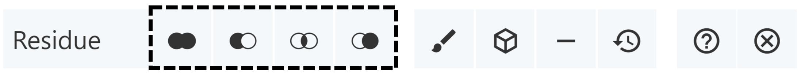

**Making Selections**
#### **Selection Mode**
Making selections is often the first step to performing a range of operations. See [Selections Logic ](maneuvering-in-mol_.md#selections-logic)for more information about how and when to use Selection Mode.

Selection Mode allows parts of 3D structures to be selected by clicking on them. It also allows residues to be selected through Set Operations Menus. Selection Mode is enabled by clicking on the cursor icon in the Toggle Menu. Activating Selection Mode opens a toolbar that appears at the top of the 3D canvas. The following provides an illustration of the toolbar and a description of each of the buttons:

|**Function**|**Description**|**Icon**|
| :-: | :-: | :-: |
|*Picking Level for Selecting and Highlighting*|Controls to what level a selection or highlight interaction is applied (i.e., atom, residue, chain, etc.)||
|*Add/Union Selection*|The new selection will be the union of the current and the other selection||
|*Remove/Subtract Selection*|The new selection will be the current selection with parts that are in the other selection removed||
|*Intersect Selection*|The new selection will be the intersection of the current selection and the other selection||
|*Set Selection*|The new selection will be the other selection||
|*Apply Theme to Selection*|Enables changes of [color](common-actions.md#color), [transparency](common-actions.md#transparency), and [clipping](common-actions.md#clipping) to be applied to the current selection||
|*Create Component of Selection with Representation*|Enables components to be created and its representations to be changed independent of other components||
|*Remove/Subtract Selection from All Components*|Removes the current selection from being displayed in the 3D canvas||
|*Undo Modify Selection*|Allows certain actions (changes of color, hiding of components, etc.) to be reverted while remaining in the selection mode||
|*Show/Hide Help*|Offers a summary of selection operations, representation operations, and mouse controls||
|*Turn Selection Mode Off*|Switches from Selection Mode to Default Mode||
#### **Picking Level**
The Picking Level in Mol\* controls to what level a selection or highlight interaction is applied. Specifically, a selection/interaction can be extended from a single atom to a residue, chain, entity, model, or structure. The default level is residue. For the case of structures with symmetry instances, the interaction can also be extended to include all atom, residue, and chain instances of the clicked atom. In addition, the Picking Level determines the specificity of a selection in the [Sequence Panel](navigating-by-sequence.md#sequence-panel), or the specificity of the focus in [Default Mode](index.md#default-mode). The Picking Level menu can be changed via a menu in the Selection Mode toolbar located at the top of the 3D canvas.

#### **Making Selections**
Making selections in Mol\* allows for many operations to be performed. Although there are several ways to make selections, the first step is to enable [Selection Mode ](making-selections.md#selection-mode)using the cursor icon in the Toggle Menu.

After activating Selection Mode, the easiest way to select is to click on objects in the 3D canvas or the [Sequence Panel](navigating-by-sequence.md#sequence-panel). Changing the [Picking Level ](making-selections.md#picking-level)makes selections more fine (e.g., selecting atoms) or more coarse (e.g., selecting whole chains).

The second way to select is with the Set Operations Menus that appear when Selection Mode is active. There are four set operations, each represented by two overlapping circles. They all open the same menu with a list of possible options for selections. If nothing is selected, the selection is empty. If an object is currently selected (i.e., the current selection is not empty), that selection can be modified with another selection using the operations. In the icons, the current selection is represented by the left circle and the other selection is represented by the right circle. After the set operation, the resulting selection (and new current selection) is represented by the filled part of the circles.

- **Add/Union:** The new selection will be union of the current and the other selection.
- **Subtract/Remove:** The new selection will be the current selection with parts that are in the other selection removed.
- **Intersect:** The new selection will be the intersection of the current selection and the other selection.
- **Set:** The new selection will be the other selection.

Another way to make selections is to use the [Components Panel](managing-the-display.md#components-panel). If a component of part of a structure is already created, it can be selected via the drop-down menu in the Components Panel. Click on the option that reads “Select This” to select that component.

Based on the [RCSB PDB mol* documentation](https://www.rcsb.org/3d-view/molstar/help/getting-started) thanks to the generosity of RCSB PDB and Dr. Shuchismita Dutta.
