**Managing the Display**
#### **Controls Panel**
This section contains panels that allow for modification and manipulation of the structure display.
#### **Structure Panel**
The Structure Panel allows the user to view the structure in different forms depending on the purpose. The options of display include the deposited coordinates or asymmetric unit (called Model) or various assemblies of the deposited coordinates.

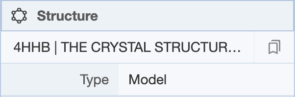

Clicking on the structure name provides a drop-down menu of the structure(s) that are present. When multiple structures are being displayed, structures can be set as active or inactive by selecting a structure using its PDB identifier.

NMR structures deposited as ensembles have multiple models in the coordinate file. The Structure Panel shows a bar where the user can scroll through the various models. There are also arrows on the top left corner of the 3D canvas for scrolling through the various models.

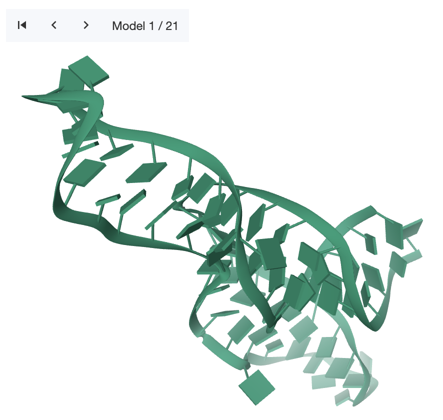

Clicking on the presets button next to the structure name provides a drop-down menu of alternate views of the structure.

- Default (Assembly): Creates a structure for assemblies in the file/entry.
- Unit Cell: Creates a structure that fills the crystallographic unit cell. Only available for X-ray entries.
- Super Cell: Creates a structure that fills the crystallographic unit cell and all neighbouring unit cells. Only available for X-ray entries.
- All Models: Creates a structure for each model in the file/entry. Only available for multi-model files/entries.

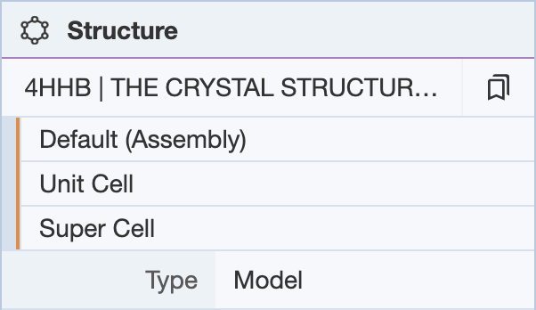

Under the structure name, you can select the type of view {Model, Assembly, Symmetry Mates, Symmetry (indices), Symmetry (assembly)}.

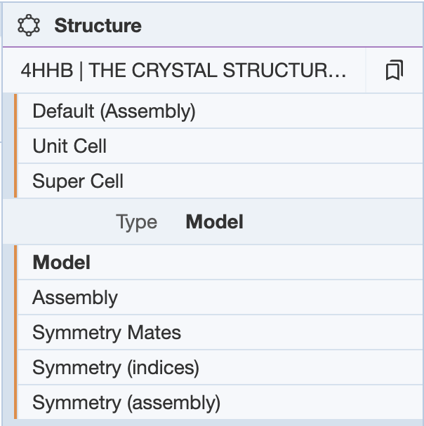

If multiple structures are uploaded at [molstar.org/viewer/](https://molstar.org/viewer/) , the Structure Panel will list all the structures. The Structures menu is useful for selecting a structure to have its components listed in the Components Panel.

#### **Measurements Panel**

The Measurements Panel allows the user to make desired measurements in a structure ([labels](managing-the-display.md#labels), [distances](managing-the-display.md#distance), [angles](managing-the-display.md#angles), [dihedrals](managing-the-display.md#dihedrals)) to observe relationships between units in the structure (e.g. hydrogen bond distance between atoms).

To start making measurements, click on the Add button and a drop-down menu will show up. In order to take measurements, the appropriate number of selections need to be made - two selections to measure distance, three selections to measure angles, and four selections to measure dihedrals. Without the appropriate number of selections, the measurement options will not be available for use. See [Selection Mode](making-selections.md#selection-mode) for information on making selections.

The measurement will be made based on which [Picking Level](making-selections.md#picking-level) is used for the selections. When the selections are atoms, the measurements will be made from the center of the atoms. If another Picking Level, such as residues or chains, is used, the measurements will be made using points from the center of the space that the selection occupies. This means that if three residues are selected for an angle measurement, the angle will not be taken from the alpha carbon, but from a point from the center of the space the residue takes up.

Within the Measurements Panel, the selections can be toggled up and down using arrows that show up next to them. This allows the user to make all of their selections first and then specifying which of the selections should be used for the measurements (toggling them up to the top of the selections listing). Additionally, the options button next to the Add button gives the option to change the units in which distance is measured, as well as color options for the text display on the 3D canvas.

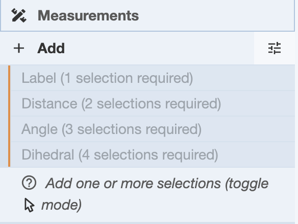

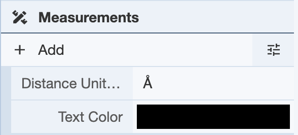

**Labels**: In order to label a part of the structure, one selection needs to be made. In this example, one atom from the structure **4HHB** was selected. Once this is done, the Labels option is available.

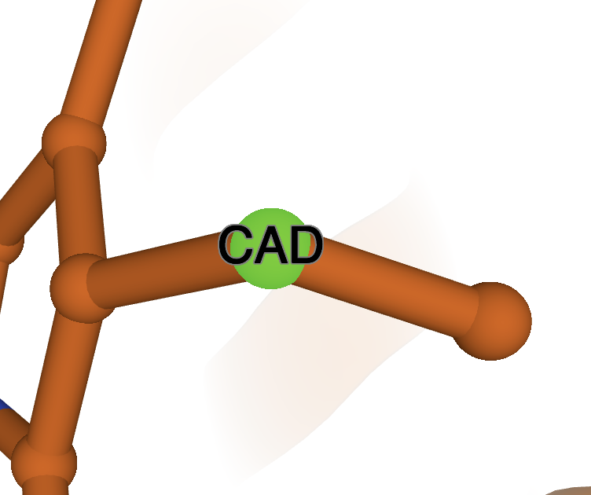

Click on it and a label will show up on the 3D canvas, as well as a new Labels menu under the Controls.

In the Labels menu, you can choose to hide the label on the 3D canvas by clicking on the eye icon, and clicking on it again will show the label. You can delete the label by clicking on the trash icon. For more options, you can click on the rightmost icon (three dots). This will reveal a drop-down menu with Options and Advanced Options, which can be used to adjust the display of the label on the 3D canvas.

**Distance**: In order to measure distance, two selections must be made. In this example, two atoms from the structure **4HHB** were selected. Once this is done, click on the Add button under the Measurements Panel. Under this, the measurement options will be shown, as well as any selections made. The Distance option is now available.

Click on it and the distance will be measured and displayed both in the 3D canvas, as well as under a new Distance menu under the controls.

The icons in the Distances menu perform the same functions as those in the Labels menu. See [Labels](managing-the-display.md#labels-menu) for more information.

**Angles**: In order to make angle measurements, three selections need to be made. In this example, three atoms from the structure **4HHB** were selected. The order in which the selections are made will affect the angle that is measured. The second selection will be the vertex of the angle, so make selections accordingly. Once three selections are made, the Angle option is available

Click on it, and an angle measurement will show up on the 3D canvas, as well as a new Angles menu under the Controls.

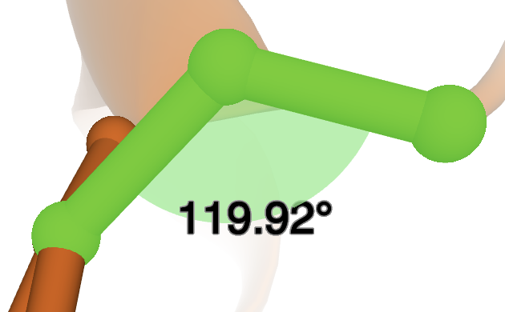
  

The icons in the Angles menu perform the same functions as those in the Labels menu. See [Labels](managing-the-display.md#labels-menu) for more information.

**Dihedrals**: In order to make a dihedral angle measurement, four selections need to be made. In this example, four atoms from the structure **4HHB** were selected. The order in which the atoms are selected will affect the angle that is measured. The second and third selections represent the line along which the angle between the first and fourth selections is measured. Once the selections are made, the Dihedral option will be available.

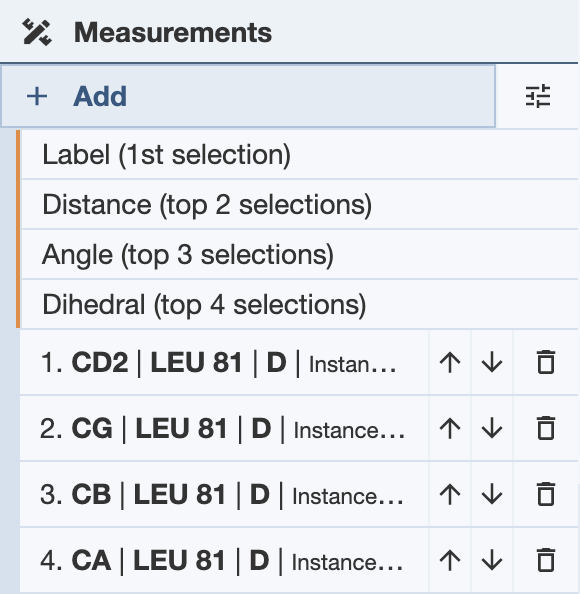

Click on the Dihedral option, and a dihedral angle measurement will show up on the 3D canvas, as well as a Dihedrals menu under Controls.

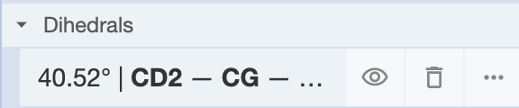

The icons in the Dihedrals menu perform the same actions as those in the Labels menu. See [Labels](managing-the-display.md#labels-menu) for more information.

#### **Components Panel**
The Components Panel shows options for the manipulation and display of the contents of the structure(s) being viewed. Components are representations of certain parts of the structure being visualized. For more information, see [Components Logic](maneuvering-in-mol_.md#components-logic).

By default, the preset that shows up when a structure is Polymer & Ligand, in which the polymers, ligands and water components are shown. Additional components can be added by selecting groups of atoms, residues, or chains.

The components shown depend on the structure and what preset is chosen as well as what components are created. The following are the presets available and a description of their functions.

- Empty: Removes all representation to give you a blank slate to work with.
- Automatic: Chooses a Basic preset based on the size (residue count, number of symmetric chains) of a structure. Smaller structures are shown with more detail than larger ones, ranging from atomistic display to coarse surfaces.
- Basic:
- Atomic Detail: Shows everything in atomic detail with Ball & Stick representation.
- Polymer Cartoon: Shows polymers in Cartoon representation.
- Polymer & Ligand: Shows polymers as Cartoon, ligands as Ball & Stick, carbohydrates as 3D-SNFG (Symbol Nomenclature For Glycans) and water molecules semi-transparent.
- Protein & Nucleic: Shows proteins as Cartoon and RNA/DNA as Gaussian Surface.
- Coarse Surface: Shows polymers as coarse Gaussian Surface.
- Annotation:
- Assembly Symmetry: Same as ‘Automatic’ preset but colored by Assembly Symmetry Cluster membership and showing Assembly Symmetry axes and polyhedron cage.
- Validation Report (Geometry Quality): Same as ‘Automatic’ preset but colored by Geometry Quality and displaying geometry clashes as pink disks.
- Validation Report (Density Fit): Same as ‘Automatic’ preset but colored by Density Fit. Only shown/available for X-ray entries.
- Validation Report (Random Coil Index): Same as Automatic preset but colored by Random Coil Index. Only shown/available for NMR entries.

A component can be added by making a [selection](making-selections.md#selection-mode) and either using the Components icon in the Selection Mode toolbar or using the Add button in the Components Panel under Controls.

Components that can be viewed under the panel can include the polymer, any ligands that are present in the structure, and any added components. Additionally, if a selection is made while in default mode, then the focused region will include two targets as well: [Focus] Target, [Focus] Surroundings (5 Å).

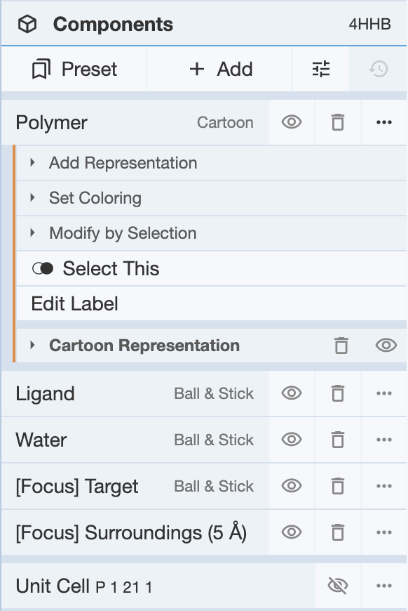

The icons next to each component perform similar functions as seen in the Measurements Panel.

When the options icon for a component is selected, various options are available.

- Add Representation: Can choose the representation of that component (cartoon, ball-and-stick, Gaussian, etc.)
- Set Coloring: Choose the coloring of the component
- Modify by Selection: Gives selection options given in the Selection Mode toolbar

A visual representation of the unit cell is also available, and can be enabled by clicking the eye icon next to the Unit Cell option.

The following are the representation options available:

- Ball & stick 
- Cartoon
- Gaussian surface
- Label 
- Molecular surface
- Orientation 
- Point
- Putty
- Validation clashes 

To modify a selection within a component, first make a selection, and choose Modify by Selection for the component of choice within the Components Panel, and choose one of these options:

- Include - This will include the selection in the component
- Subtract - This will remove the selection from the component
- Intersect - This will change the component to be the intersection between the original component and the selection

Additionally, the Options button next to the Add button under the components panel allows for adjustments for the representation of non-covalent interactions. Display of hydrogen atoms in the visual can be toggled on and off. Additionally, clicking Non-covalent interactions yields a drop down menu with various types of non-covalent interactions. These can be toggled on and off for display in the non-covalent interactions representation. Additionally, clicking on the options button (three dots) next to any of the interactions yields a drop down menu for various parameters for that interaction. This menu can be used to tweak the parameters for calculation for any of the interactions.

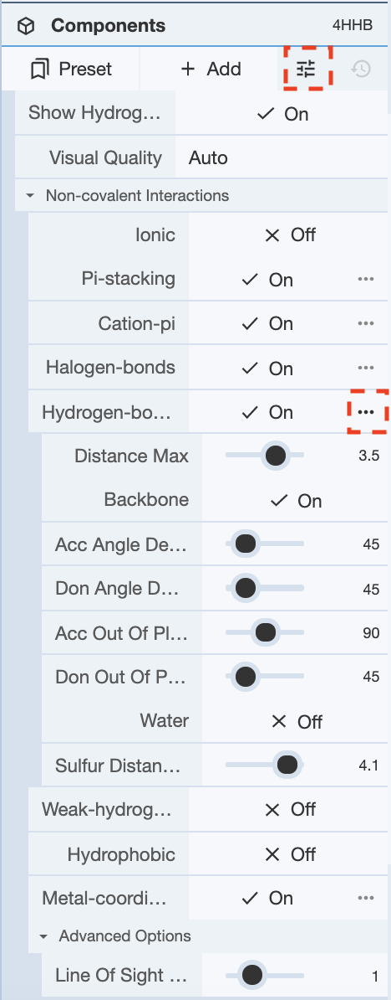

#### **Density Panel**
The Density Panel gives options to display the electron density maps used to determine the structure in the 3D canvas. This option is only available for structures solved by X-ray crystallography or cryogenic electron microscopy. When enabled, the display of each of the maps can be adjusted using the sliding bars available.

Visualization of the maps can be adjusted by clicking the + icon next to each map, which will give a drop-down menu of options. They can be shown by a wireframe, which can be turned on by clicking next to the Wireframe option. The color of each map can be changed in this map, as well as the opacity of the map.

View of the maps can be adjusted by clicking on the drop-down menu next to the View button, which gives options to view the maps in different settings. In this menu, the density maps can be turned off, as well as adjusted to be shown around a focus, for the whole structure, or for a bounded box. For the bounded box, the user can select the coordinates of the bottom left and top right corners of the box within which the density maps will be displayed.

In order to view any changes made within this panel, click Update at the bottom of the panel.

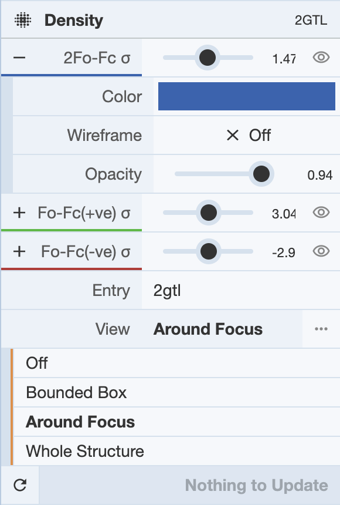

#### **Assembly Symmetry Panel**
The Assembly Symmetry Panel demonstrates any symmetries within the molecule when displayed in Assembly mode. Once enabled, any symmetries that are in the molecule will be available as a drop-down menu to display and visualize on the 3D canvas. Additionally, the [coloring](common-actions.md#color) of the symmetry can be adjusted.

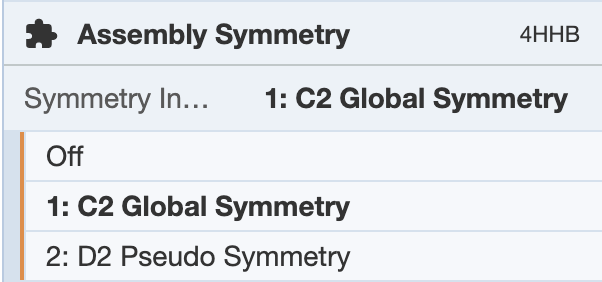

#### **Import Panel (only available at [molstar.org/viewer/](https://molstar.org/viewer/))**
The Import Panel enables users to upload multiple molecular structures into Mol\* to compare them or perform superpositions. The Import Panel can only be accessed at [molstar.org/viewer/](https://molstar.org/viewer/) and is located at the top of the Controls Panel.

**Open Files:** The Open Files menu is used to upload structures from computer files. The menu also provides structure display options. To automatically view the structure in the 3D canvas, set Visuals to “On.” After a file is selected and the desired options are chosen, click “Apply” to upload the structure.

**Download Structure:** The Download Structure menu is used to access or download structures directly from various archives such as the PDB, PDB-Dev, SWISS-MODEL, or PubChem by inputting IDs/accession codes. The identifiers of multiple structures can be listed at once by separating them with commas. After the identifiers have been inputted, click “Apply” to upload the structures.

#### **Session Panel (only available at [molstar.org/viewer/](https://molstar.org/viewer/))**
The Session Panel enables users to save sessions and views. Sessions are downloaded as computer files which can be opened in Mol\* at any time. In addition, users can share session files with others to collaborate. Within a Mol\* session, users are able to create “views” which contain all the information in the 3D canvas at the time the views were saved. Multiple views can be saved in a single session. The Session Panel can only be accessed at [molstar.org/viewer/](https://molstar.org/viewer/) and is located in the Controls Panel.

**Saving Views:** The Views menu is used to save views in Mol\*. Users can name views and write a description for each one. After clicking “+ Add,” the view will be saved in the Views menu for the entirety of the session.

**Deleting/Replacing Views:** The Views menu contains a list of all saved views. Next to each view is a trash can icon. Clicking that icon allows the view to be deleted from the Mol\* session. To replace a view, click on the horizontal parallel arrows icon. This will replace the view with the current view in the 3D canvas. Deleting and replacing views are actions that cannot be undone.

**Opening Saved Views:** There are two ways to open saved views in Mol\*.

- All saved views will be listed in the Views menu. Click on a view to open it.
- If multiple views are saved, they can be accessed using a drop-down menu at the top of the 3D canvas. Clicking on a view will open it. The order in which the views are listed depends on the time they were saved. To reorder the views, use the up and down arrows next to each view in the Views menu. In default mode, use the arrows pointing left and right to switch between saved views.

**Cycle Through Saved Views:** In default mode, click the “play” button in the toolbar at the top of the 3D canvas to cycle between all saved views. Click the “stop” button to stop cycling between them.

**Download/Open Menu:** The Download/Open menu allows users to save sessions and states. It also allows them to be reopened at any time.

#### **Superposition Panel (only available at [molstar.org/viewer/](https://molstar.org/viewer/))**
The Superposition Panel rotates and translates molecular structures to make them match other structures. Mol\* performs superpositions by matching selected chains or atoms. The root-mean-square deviation (RMSD) of the superposed structures will be listed in the Log Panel at the bottom of the application window. To access the Superposition Panel, two or more structures must be [uploaded](managing-the-display.md#import-panel) at [molstar.org/viewer](https://molstar.org/viewer/). The Superposition Panel will appear in the Controls Panel next to the 3D canvas.

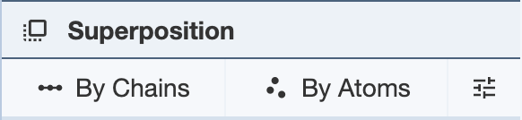

**Superposing by Chains:** In order to superpose structures by chains, two or more selections from separate structures are required. Regions of a chain can also be selected for superposition. For each PDB entry, [selections](making-selections.md#selection-mode) must be limited to single polymer [chains](making-selections.md#picking-level) per structure. If using a region of a chain, only one region per chain can be used for each structure. After making two or more selections, click “Superpose” to superpose the structures in the 3D canvas. While the superposition is per chain, the resulting 3D transformation is always applied to the whole structure. When superposing more than two structures, note that the alignment is done to the first structure. The RMSD will be listed in the Log Panel.

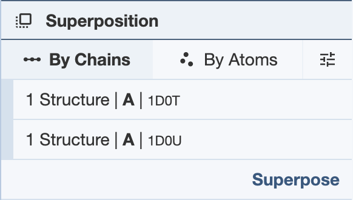

**Superposing by Atoms:** In order to superpose structures by atoms, one or more atoms from separate structures must be selected. [Select](making-selections.md#selection-mode) one or more [atoms](making-selections.md#picking-level) and click “Superpose” to superpose the structures in the 3D canvas. The superposition is done on all given pairs of atoms in the order they appear in the panel. To reorder the atoms, use the up and down arrows in the panel. The RMSD will be listed in the Log Panel.

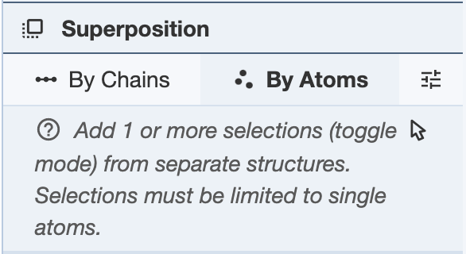

Based on the [RCSB PDB mol* documentation](https://www.rcsb.org/3d-view/molstar/help/getting-started) thanks to the generosity of RCSB PDB and Dr. Shuchismita Dutta.
