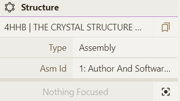

**Maneuvering in Mol\***
#### **Understanding how to Maneuver through Mol\***
Visualizing structures in Mol\* requires an understanding of how to maneuver through the controls. This section is aimed at explaining the fundamentals of how Mol\* works and how to effectively perform actions within it.

#### **Focus**
Focusing adjusts the view of the camera and the center of rotation on specific atoms, residues, or parts of structures. Once the camera is focused on a selection, other items in the structure may appear hidden from the camera because they fall outside the region being viewed or are clipped. There are four ways to change the focus of the camera:

1. In default mode, click on a residue in the 3D canvas. It will automatically be centered and zoomed-in. The residue along with its surrounding residues will be represented as ball & stick. All local non-covalent interactions will be shown.
1. In default mode, click on a residue in the Sequence Panel. It will automatically be centered and zoomed-in. The residue along with its surrounding residues will be represented as ball & stick and nearby interactions will be shown.
1. If an object is listed in the [Components Panel](managing-the-display.md#components-panel), it can be clicked on which will make it the focus of the camera.
1. If an object is currently selected, it will be listed in the [Structure Panel](managing-the-display.md#structure-panel). For example, if four residues are selected, the Structure Panel will read “4 Residues Selected.” If this text is clicked on, the four residues will become the focus. 

#### **Selections Logic**
Making selections is often the first step to performing a range of operations. Selections are made using [Selection Mode](making-selections.md#selection-mode) which is activated using the cursor or arrow head icon in the Toggle Menu. The [Picking Level](making-selections.md#picking-level) determines the specificity of the selection. For example, keeping the Picking Level on “residue” enables individual or groups of amino acid residues to be selected, while changing the Picking Level to “chain” allows whole chains to be selected. After the desired Picking Level is chosen, selections can be made by:

- Clicking on parts of the structure in the 3D canvas
- Clicking on residues in the Sequence Panel
- Using the Set Operations Menus in Selection Mode toolbar

After selections are made, several tasks can be directly performed using the current selection. These include:

- [Creating a component](managing-the-display.md#create-component) of the current selection
- [Coloring](common-actions.md#color) the current selection
- Changing the [transparency](common-actions.md#transparency) of the current selection
- Changing the representation of the current selection (e.g., ball & stick, molecular surface)
- Removing the current selection from the 3D canvas
- Focusing on the current selection
- Creating [measurements](managing-the-display.md#measurements-panel)

#### **Components Logic**
After making a selection, a component can be made from it. Creating components allows the user to make groupings of certain parts of a structure which can later be manipulated. It is not always necessary to create components, but it can be helpful in certain circumstances. For example, if you have selected a number of residues in a protein that you may be returning to multiple times to perform different actions, it may be helpful to create a component for quick reference.

The following are actions that can be performed with components:

- Showing/hiding using the eye icon
- Changing the representation
- Coloring by various requirements
- Modifying the component by selection to add, subtract, or intersect pieces
- Deleting the component - this will remove the grouping but the structure will remain intact

Once again, it is not always required to make components, but can be useful for easy reference. Clicking on a component in the [Components Panel](managing-the-display.md#components-panel) will quickly focus on that component in the 3D canvas. Additionally, the component can be easily selected from the Components Panel.

Using a component can be helpful for certain tasks:

- Briefly hiding a group to view another part of the structure
- Coloring a selection with specific settings
- Changing the representation after hiding certain parts of the structure
- Grouping certain parts of different components into other components by modifying selection

Based on the [RCSB PDB mol* documentation](https://www.rcsb.org/3d-view/molstar/help/getting-started) thanks to the generosity of RCSB PDB and Dr. Shuchismita Dutta.
