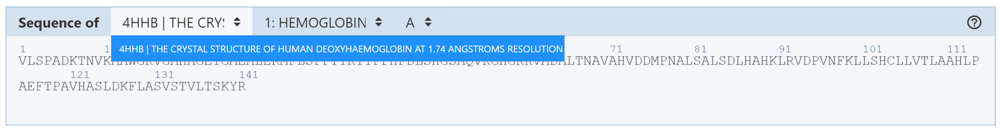
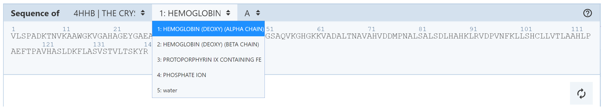
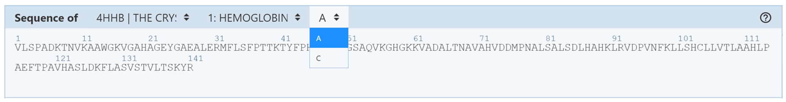

**Navigating by Sequence**
#### **Sequence Panel**
The Sequence Panel displays the polymer sequences of macromolecules (proteins and nucleic acids) present in the uploaded PDB structure(s). In addition, it provides quick access to any small molecular ligands or entities present in the structure. It enables several operations to be performed such as selecting residues and focusing on ligands. The Sequence Panel is located above the 3D canvas and contains three drop-down menus that allow the user to choose which sequence to display.

- **First drop-down menu:** allows the user to decide which structure the sequence should be from. If multiple structures are uploaded into Mol\*, this drop-down menu will list the PDB IDs of each structure along with a short summary of each one. The user should click the structure from which they want to view the sequence. If one structure is uploaded into Mol\*, there will be only one option in this drop-down menu.

- **Second drop-down menu:** allows the user to decide which entity’s sequence should be displayed.

- **Third drop-down menu:** allows the user to decide which part of an entity the sequence should be from. If there are multiple copies of the entity in the structure, this drop-down menu will list them based on their chain IDs.

Based on the [RCSB PDB mol* documentation](https://www.rcsb.org/3d-view/molstar/help/getting-started) thanks to the generosity of RCSB PDB and Dr. Shuchismita Dutta.
