# Illustrative style guide

A pictured guide for creating @dsgoodsell`s iconic illustrative style in #molstar.

We will use the Golgi Casein Kinase (PDB 5yh2) #motm as an example https://pdb101.rcsb.org/motm/265.

View the final state online https://molstar.org/viewer/?snapshot-url=https://molstar.org/viewer-docs/tips/illustrative-style-export/5YH2-illustrative.molx&snapshot-url-type=molx

# Use preset

The easiest way is to use the "Illustrative" preset from the Presets in the Components panel. This applies the overall illustrative style. You can still adjust the displayed chains (step 4 & 5) and the color theme options (step 6 to 8) as outlined in the full guide.

# Coloring styles

The "Illustrative" color theme (see step 6 to 8 in the full guide) has 5 "Style" options. All color carbons lighter but the base color is differently set.

- "Uniform": Single color
- "Chain Id": Color per chain (label/auth)
- "Entity Id": Color per entity (the default)
- "Entity Source": Color per entity source (for chimeras)
- "Molecule Type": Color by protein/RNA/DNA/...

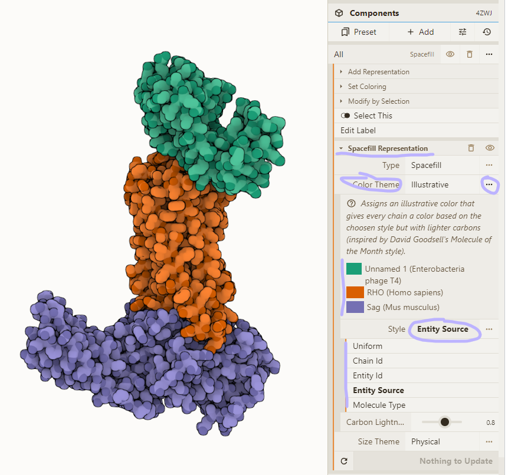

# Load PDB and reset style

1. Load PDB 5YH2 using the Download Structure action in the top left
2. Clear all visuals by selecting the "Empty" preset in the Components panel
3. Add a spacefill representation for everything:

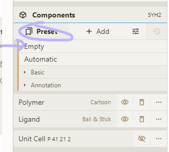

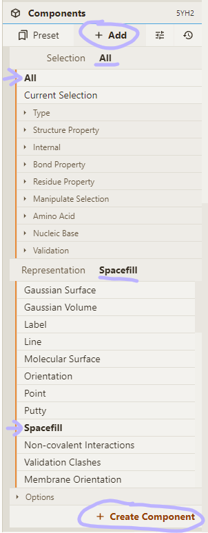

# Adjust selection

4. Activate selection mode; pick "Chain" granularity; click on chains to be removed
5. "Subtract" your selection from the "All" entry in the Components panel

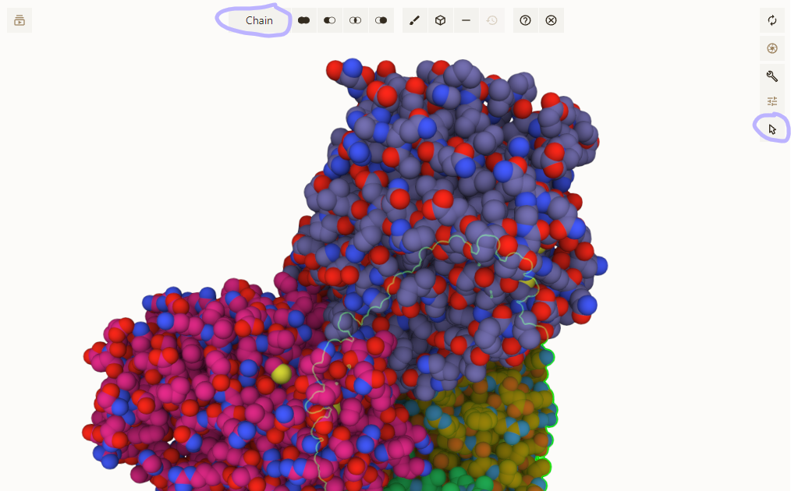

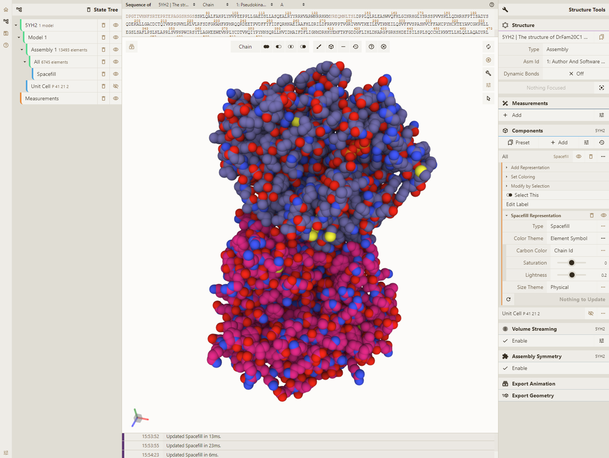

# Adjust coloring

6. Select the "Illustrative" color theme for our "Spacefill" representation
7. Change the "Style" option to "Chain Id" and set the "Asym Id" option to "Label"
8. Enable theme legend; drill down to color list; change colors for our chains

Chain C: (101, 153, 255)
Chain D: (79, 231, 156)
Chain F: (255, 76, 255)

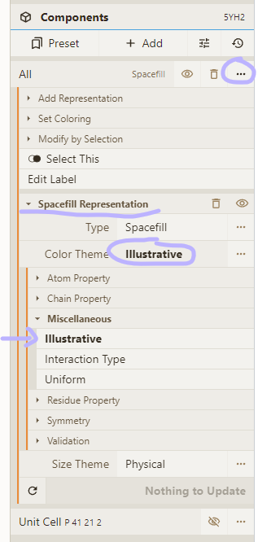

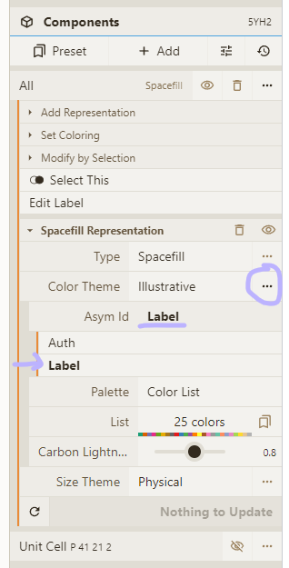

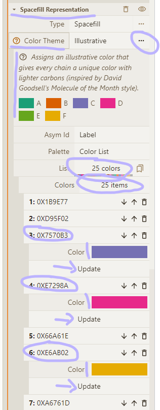

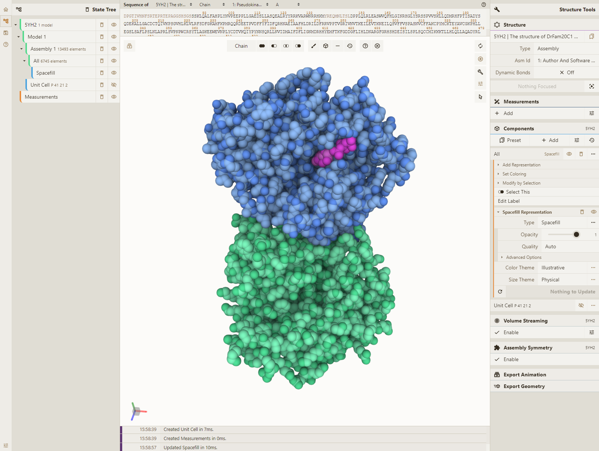

# Adjust lighting

9. Enable occlusion and outline in the Settings menu; tweak occlusion bias and outline threshold
10. Enable "Ignore Light" option for our "Spacefill" representation

Congratulations, you made it through a lot of tedious (but powerful) UI actions. Enjoy and share.

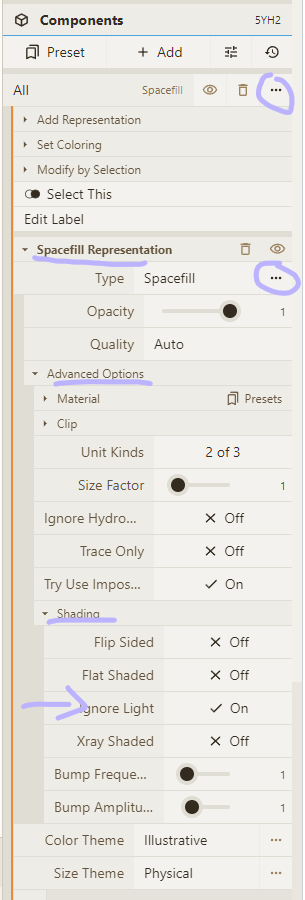

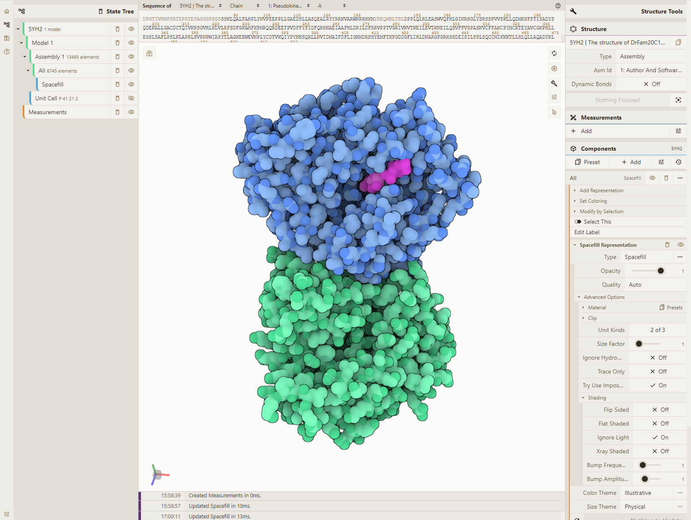
