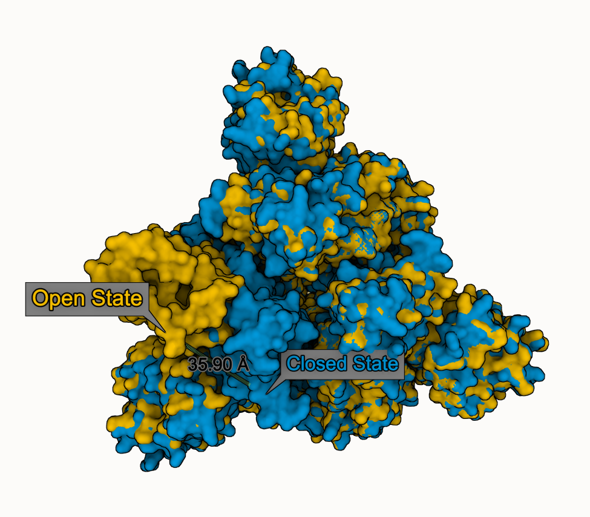
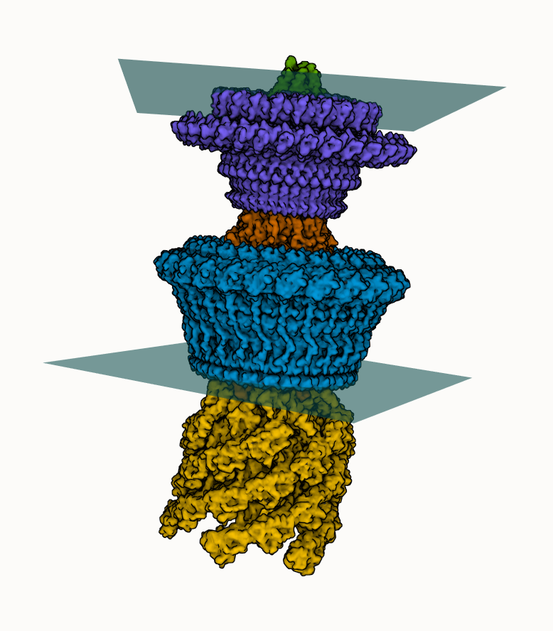
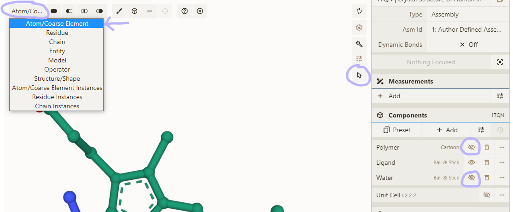
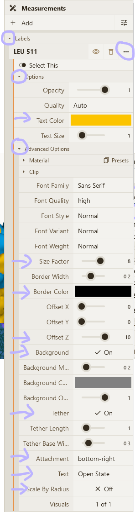
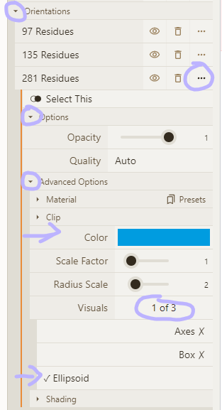

# Measurements overview

Some tips & examples for doing measurements in #molstar at https://molstar.org/viewer

- label, distance, angle, dihedral
- orientation (box/axes from principal components)
- plane (best fit)

# Basic measurements

- Load PDB 1TQN; hide Polymer and Water component
- Enable selection mode; set granularity to "Atom/Element"
- Open Measurements panel & select some atoms
- Click one of the options available (depend on number of selected atoms)

View: https://molstar.org/viewer/?snapshot-url=https://molstar.org/viewer-docs/tips/measurements/basic.molx&snapshot-url-type=molx

# Distance example

We compare closed (PDB 6VXX) and open (PDB 6VYB) state of SARS-CoV-2 spike glycoprotein

- Superpose both states
- Select Leu 511 from chain B in both states
- Add "distance" & "label" using Measurements panel
- Adjust visual options

View: https://molstar.org/viewer/?snapshot-url=https://molstar.org/viewer-docs/tips/measurements/distance.molx&snapshot-url-type=molx

# Orientation box/axes

We use "orientation" ellipsoids to show the 3 domains of Pyruvate Kinase (PDB 1PKN)

- Select the PK domain (116-217)
- Add "orientation" and "label"; adjust visual options
- Repeat for PK N (12-115 & 218-395) and PK C (396-530)

View: https://molstar.org/viewer/?snapshot-url=https://molstar.org/viewer-docs/tips/measurements/orientation.molx&snapshot-url-type=molx

# Best fit plane

We can add two best fit planes indicating lipid membranes to the bacterial flagellar motor-hook complex (@Jiaxing_Tan_ et al.)

- Select a few residues at the edge of the M-ring protein
- Add "plane" using Measurements panel
- Adjust visual options
- Repeat for the L-ring protein

View: https://molstar.org/viewer/?snapshot-url=https://molstar.org/viewer-docs/tips/measurements/plane.molx&snapshot-url-type=molx

