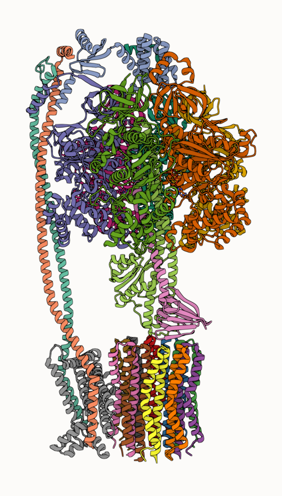
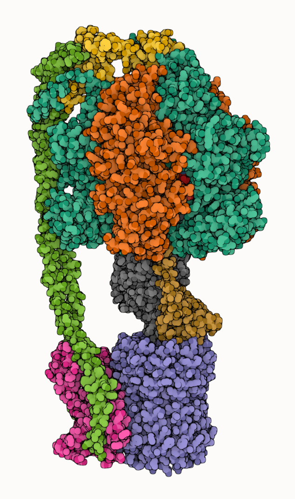

Added a Quick Styles panel to #molstar to quickly apply styles: default, stylized, illustrative.

## Default

Applies default representation preset. Set outline and occlusion effects to defaults.

## Stylized

Applies no representation preset. Enables outline and occlusion effects. Enables ignore-light representation parameter.

## Illustrative

Applies illustrative representation preset. Enables outline and occlusion effects. Enables ignore-light parameter.

Quickest way to emulate @dsgoodsell`s iconic illustrative style in #molstar.

