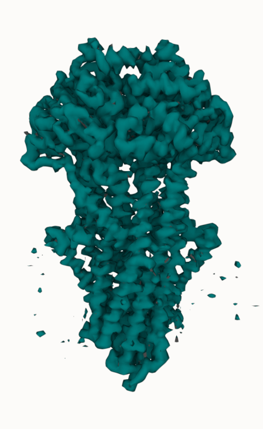
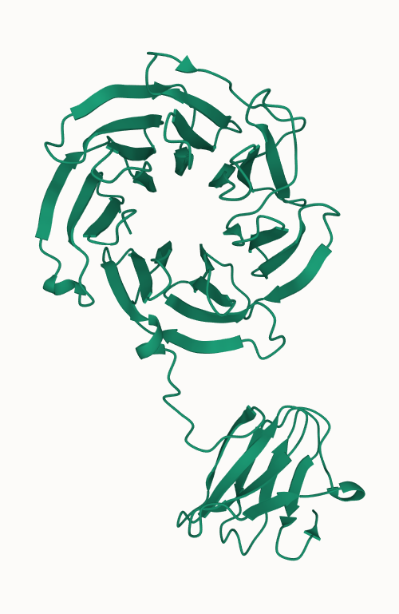

# Load from Archives

You can easily load structures & volumes from archives with an URL parameter. We support PDB, PDB-Dev, EMDB, AlphaFold DB, and Model Archive

- PDB: https://molstar.org/viewer/?pdb=7VUI
- EMDB: https://molstar.org/viewer/?emdb-provider=rcsb&emdb=EMD-13614
- AlphaFold DB: https://molstar.org/viewer/?afdb=Q8W3K0

Note that for best speed you can specify to download from RCSB PDB, PDBe, or PDBj using the pdb-provider parameter, depending where you are.

# Load from URL

You can also load structures and #molstar snapshots (.molx files) from any URL. Just make sure the server supports CORS.

- structure: https://molstar.org/viewer/?structure-url=https://swissmodel.expasy.org/repository/uniprot/Q9Y2I8.pdb&structure-url-format=pdb
- molx: https://molstar.org/viewer/?hide-controls=1&snapshot-url=https%3A%2F%2Fmolstar.org%2Fdemos%2Fstates%2Fgain-md-alt.molx&snapshot-url-type=molx

# More

Read about all #molstar viewer URL parameters in the docs https://molstar.org/viewer-docs/query-parameters/