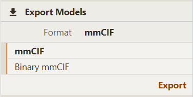
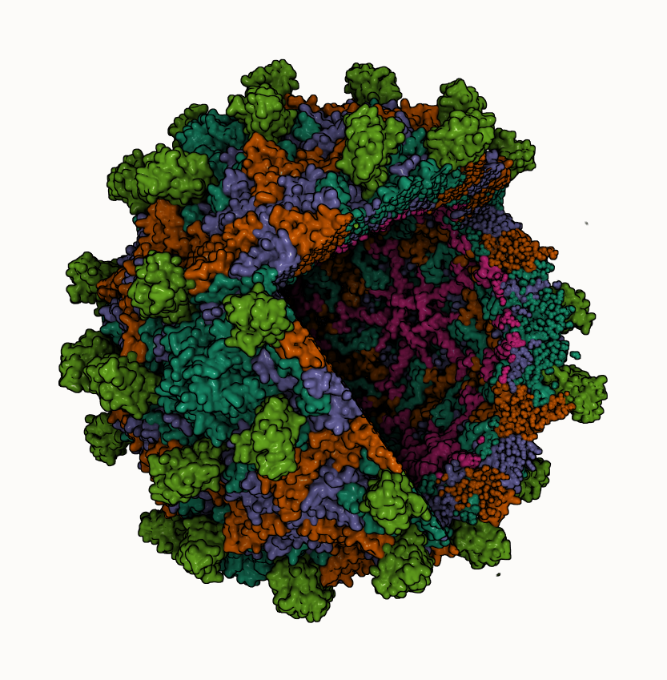
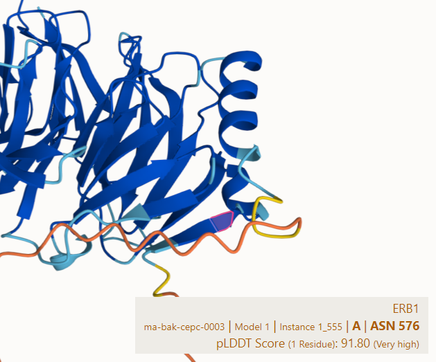
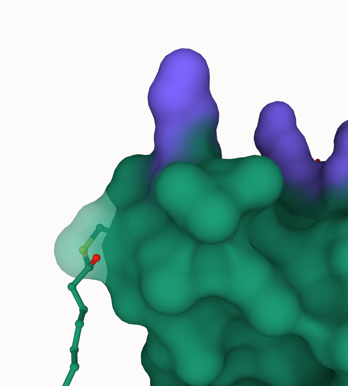

# Release

We just released #molstar v3 ✨ with fixes, improvements and new features. Try the #WebGL powered molecular viewer on https://molstar.org

Highlights include:

- Improved rendering materials
    - https://molstar.org/viewer/?snapshot-url=https://molstar.org/viewer-docs/tips/v3/material.molx&snapshot-url-type=molx
- Model export support: mmCIF (including BinaryCIF)

# Highlights

- Improved per-object clipping
    - https://molstar.org/viewer/?snapshot-url=https://molstar.org/viewer-docs/tips/v3/clip.molx&snapshot-url-type=molx
- Quality Assessment score support for AlphaFold & Model Archive files
- Improved surface coloring/transparency
    - https://molstar.org/viewer/?snapshot-url=https://molstar.org/viewer-docs/tips/v3/surface.molx&snapshot-url-type=molx
- Drag'n'drop for any support file type (including multi-model zip files)

@buildmodels @PDBeurope @CEITEC_Brno @sehnaldavid

