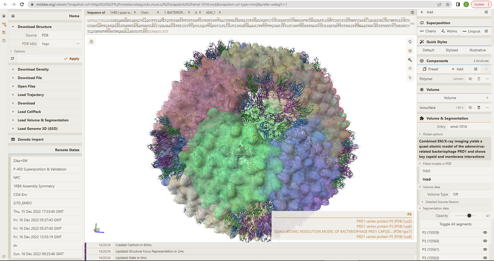
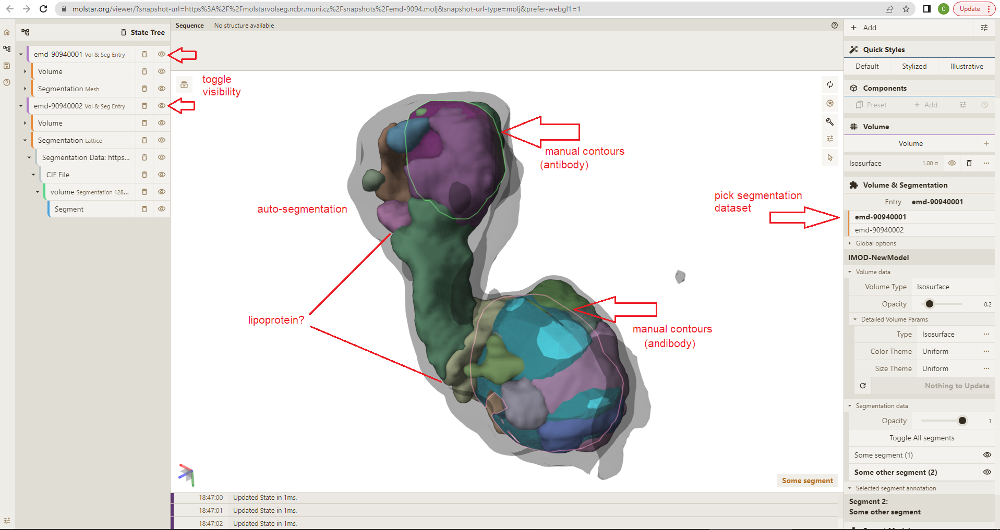

# Examples

Here are a few examples of how cross-scale microscopy data can be explored using Mol\*VS. If you are not familiar with Mol\* Viewer, it will take you a bit of time to get your brearings, so we hope that these examples will help you on your journey.

## Across experiments and scales ##
[San Martin et al.](https://www.cell.com/structure/fulltext/S0969-2126(01)00642-6) conducted extensive cryo-EM imaging and refined 3D reconstruction of a large bacteriophage by fitting a crystalographic model of P3, the major protein forming the capsid of this bacteriophage, into the cryo-EM data. They were then able to infer potential interactions between the capsid protein and an underlying membrane holding the genomic material of this bacteriophage, as well as to derive a model of this bacteriophage at quasi-atomic resolution. 

**With Mol\*VS, wou can now examine the outcomes of these complex experiments interactively in the web browser and conduct further examinations of your own.** Access a [pre-made visualization state of the bacteriophage](https://molstar.org/viewer/?snapshot-url=https%3A%2F%2Fmolstarvolseg.ncbr.muni.cz%2Fsnapshots%2Femd-1014.molj&snapshot-url-type=molj&prefer-webgl1=1). 

Examine source data: cryo-EM map available in EMDB as [EMD-1014](https://www.ebi.ac.uk/emdb/EMD-1014); crystallographic model used for refining the cryo-EM reconstructions available in PDB as [1HX6](https://www.rcsb.org/structure/1hx6); 3D models of the bacteriophage at quasi-atomic resolution as derived from this study available in PDB as [1HB5](https://www.rcsb.org/structure/1hb5) (P3-shell), [1HB7](https://www.rcsb.org/structure/1hb7) (nonsense mutant that does not package DNA), and [1HB9](https://www.rcsb.org/structure/1hb5) (wild type).

## Comparing segmentations ##
Segmentation, which is the decomposition of a 2D or 3D image into regions that can be associated with defined objects, has been recognized as the bridge to interpreting microscopy data in a biological context. A plethora of volume segmentation algorithms and tools are available via commercial or non-commercial solutions, each with their own requirements for input/output formats and limitations related to data processing. There is no consensus regarding the best method to obtain segments that can be associated with a biologically relevant role. Most often, it is necesary to try several approaches and compare the outcomes. 

[Dongsheng et al.](https://www.sciencedirect.com/science/article/pii/S1388198118303718?via%3Dihub) reconstructed 3D density maps from cryo-TEM experiments of human plasma intermedia-density lipoproteins in complex with mouse antibodies. They were then able to infer that such lipoprotein particles have a polyhedral shape and are composed of low-density cores and high-density shells. Lipoporteins serve to transport fat in the bloodstream, and thus their shape and structure may represent key drivers of atherosclerosis risk. Therefore, a more detailed characterization of their shape is highly desirable and can be achieved by segmenting the density map into smaller connected shapes. However, it is unclear what segmentation tool will be most useful for this endeavor.

**With Mol\*VS, you can easily compare the outcomes of different segmentation methods applied to the same data set and decide which is more useful for your particular situation.** To illustrate, we have obtained segmentations of the cryo-TEM map in two ways. First, the map was loaded into IMOD and two segments were drawn manually as contours, which were then interpolated over all slices and exported as a mesh. Next, the same map was loaded in ChimeraX, the Segment Map tool (Segger plugin) was used to perform automatic segmentation with default settings and a default density threshold of 0.334671, and the output lattice was stored in the Mol\*VS internal database. Access a [pre-made visualization state of superimposed segmentations](https://molstar.org/viewer/?snapshot-url=https%3A%2F%2Fmolstarvolseg.ncbr.muni.cz%2Fsnapshots%2Femd-9094.molj&snapshot-url-type=molj&prefer-webgl1=1) of the lipoprotein particles and compare the smooth shape of the lipoprotein particle inferred via manual contours versus the very granular and concave shapes inferred by auto-segmentation.

Examine source data: cryo-TEM map available in EMDB as [EMD-9094](https://www.ebi.ac.uk/emdb/EMD-9094); segmentation meshes obtained using IMOD and Segger available in the Mol\*VS internal database as EMD-9094001 and EMD-9094002, respectively. 

## Tissue microscopy data ##
Exploring very large datasets from tissue microscopy experiments - FIB-SEM of mitochondrial reticulum in murine skeletal muscle
[Access a pre-made visualization state for empiar-10070](https://molstar.org/viewer/?snapshot-url=https%3A%2F%2Fmolstarvolseg.ncbr.muni.cz%2Fsnapshots%2Fempiar-10070.molj&snapshot-url-type=molj&prefer-webgl1=1)
Examine source data: FIB-SEM volume data availale in EMPIAR as [EMPIAR-10070](https://www.ebi.ac.uk/empiar/EMPIAR-10070/)

## Light microscopy data ##
Exploring large datasets from light microscopy experiments
(IDR-6001240)
[Access a pre-made visualization state for idr-6001240](https://molstar.org/viewer/?snapshot-url=https%3A%2F%2Fmolstarvolseg.ncbr.muni.cz%2Fsnapshots%2Fidr-6001240.molj&snapshot-url-type=molj&prefer-webgl1=1)
