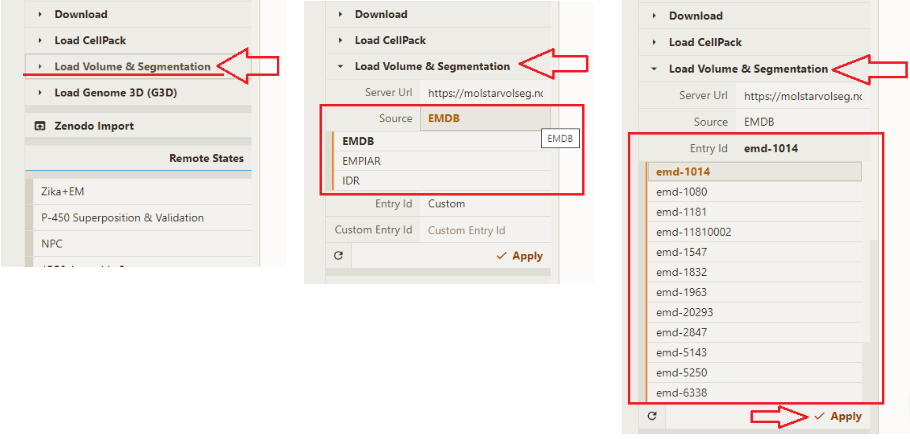

# How to

## Accessing Mol\*VS
Mol\*VS is free and open to all users. There is no login requirement for accessing the following Mol\*VS resources.

**[Mol\*VS landing page](https://molstarvolseg.ncbr.muni.cz/)**, a hub for all Mol\*VS resources, including a few interesting examples, documentation, and, most importantly, access to [Mol\* Viewer with the Mol\*VS extension](https://molstar.org/viewer/), which you will use to visualize the entries of the Mol\*VS internal database.

**[Mol\*VS documentation](http://molstar.org/viewer-docs/volumes_and_segmentations/overview/)**, which is integrated with the Mol\* documentation.

**[Mol\*VS development page on GitHub](https://github.com/molstar/molstar-volseg)**, where you can get the source code and raw documentation, as well as follow the development. 

Mol\*VS is an open-source project with a permissive MIT license, which means that you can use the source code to host Mol\*VS locally, derive your own solution built on top of Mol\*VS, incorporate Mol\*VS in your pipelines, all free of charge and with no login requirement. 

If you would like to contribute to the development of the Mol\*VS project by submitting issues, writing code, or preparing documentation, you will need a GitHub account.

## Accessing database entries

All entries in the Mol\*VS internal database are accessible via Mol\* Viewer with the Mol\*VS extension, available free of charge and without login requirement at https://molstar.org/viewer/.

The Mol\*VS extension can be accessed in the **Home tab** of the **Main Menu**. Pick the source database and the entry and click **Apply**.

Check the Log Panel at the bottom of the page for the loading progress and any errors. Most entries will load in no more than a few seconds.

Once the data have loaded, you can manipulate the objects in the 3D scene, examine annotations, and load related macromolecular data. We will go over typical scenarios below, but you can always check the Mol\* Viewer documentation for extensive explanations about all graphical elements and how to get the best out of the visuals.

If the **State Tree** does not show any 3D representation, you can wait a bit or create it yourself.

If you encounter other trouble rendering, please try changing one or more settings as described in the [Known issues section](http://molstar.org/viewer-docs/volumes_and_segmentations/known-issues/). 
