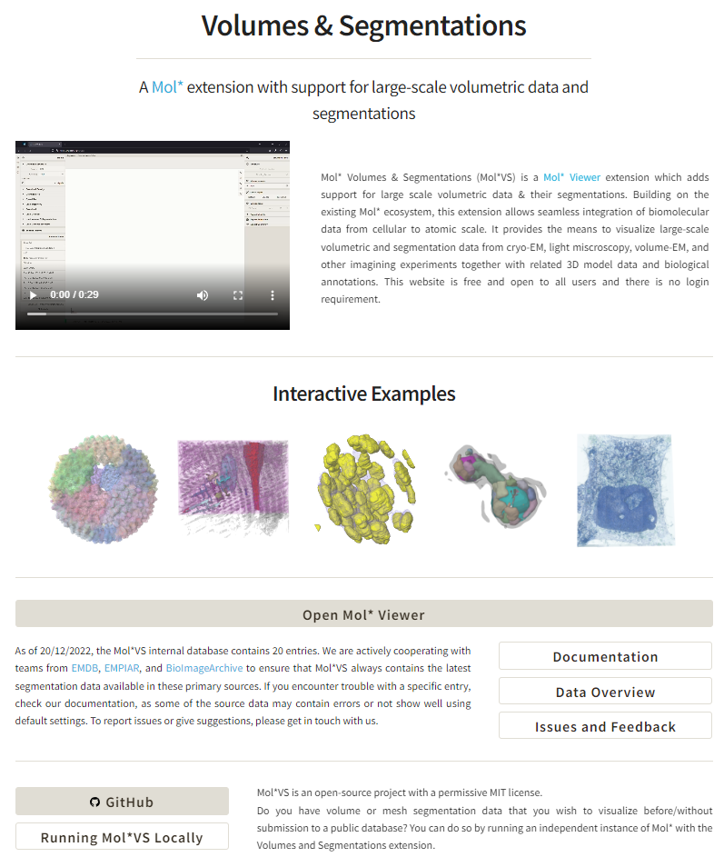
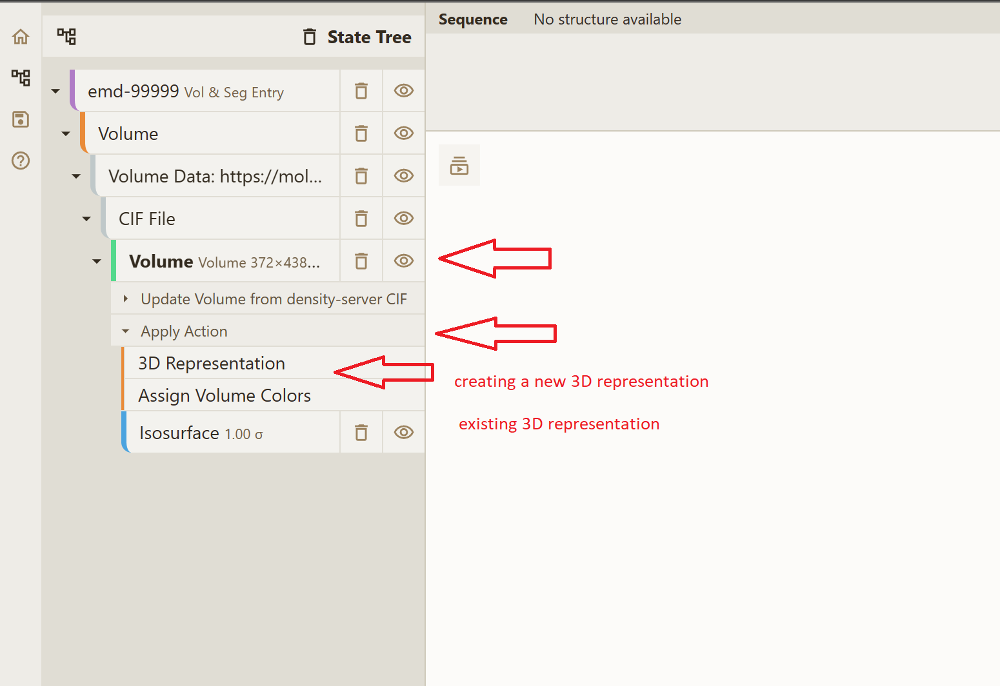

# How to

## Accessing Mol\*VS
Mol\*VS is free and open to all users. There is no login requirement for accessing the following Mol\*VS resources.

**[Mol\*VS landing page](https://molstarvolseg.ncbr.muni.cz/)**, a hub for all Mol\*VS resources, including a few interesting examples, documentation, and, most importantly, access to [Mol\* Viewer with the Mol\*VS extension](https://molstar.org/viewer/), which you will use to visualize the entries of the Mol\*VS internal database.

**[Mol\*VS documentation](http://molstar.org/viewer-docs/volumes_and_segmentations/overview/)**, which is integrated with the Mol\* documentation.

**[Mol\*VS development page on GitHub](https://github.com/molstar/molstar-volseg)**, where you can get the source code and raw documentation, as well as follow the development. 

Mol\*VS is an open-source project with a permissive MIT license, which means that you can use the source code to host Mol\*VS locally, derive your own solution built on top of Mol\*VS, incorporate Mol\*VS in your pipelines, all free of charge and with no login requirement. 

If you would like to contribute to the development of the Mol\*VS project by submitting issues, writing code, or preparing documentation, you will need a GitHub account.

## Accessing database entries

If the **State Tree** does not show any 3D representation, you can wait a bit or create it yourself:

If you encounter other trouble rendering, please try changing one or more settings as described in the [Known issues section](http://molstar.org/viewer-docs/volumes_and_segmentations/known-issues/). 

## Typical scenarios
