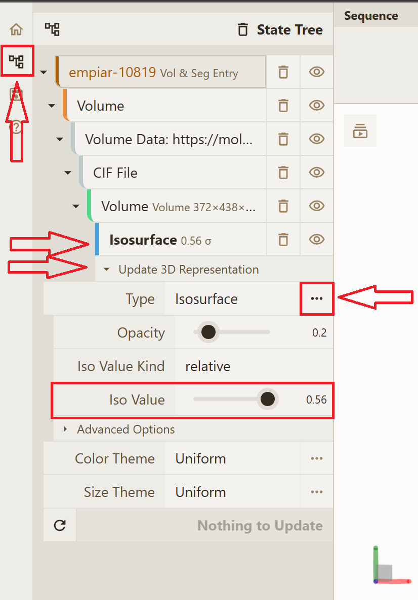
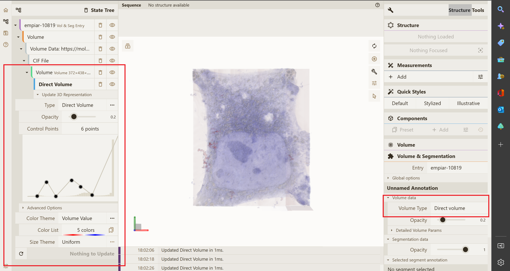

# Known issues and limitations

## General
The limitations of Mol\*VS are related primarily to the scarcity of segmentation data and insufficient unification of volumetric and segmentation data formats. As of December 2022, EMDB and EMPIAR together contain less than 20 [entries with segmentation data](https://www.ebi.ac.uk/empiar/volume-browser/), and even these few data sets are not fully consistent in terms of data hierarchy. This is expected to change in the future, as substantial effort is being expended to unify cell imaging data under the [EMDB-SFF](http://europepmc.org/article/MED/28682240) (electron microscopy) and [OME-NGFF](https://www.nature.com/articles/s41592-021-01326-w) (light microscopy). We are actively cooperating with teams from EMDB, EMPIAR, and BioImageArchive to ensure that Mol\*VS always contains the latest segmentation data available in these primary sources. Meanwhile, we have included several examples to indicate that Mol\*VS is prepared to handle data sets delivered in EMDB-SFF, other formats that can be converted to EMDB-SFF via [sfftk python package](https://sfftk.readthedocs.io/en/latest/) integrated in Mol\*VS (.am, .mod, .seg, .stl), and OME-NGFF.

One important limitation is related to the data structures currently used by Mol\*VS. Specifically, it is currently not possible to store and display multiple segmentations for the same volumetric map. These will show as separate entries of the internal Mol\*VS database (e.g., emd-90940001 and emd-90940002 were obtained from the same source data emd-9094 using different segmentation tools).

Finally, some limitations are related to the current state of Mol\* Viewer. Because the source data vary substantially, it has so far not been possible to establish default settings that work equally well for all data sets and all machines.

If the **State Tree** does not show any 3D representation, you can wait a bit or create it yourself:

If you encounter other trouble rendering, please try changing one or more settings as described below. 

## GPU support
Some graphics cards may fail to render certain data (e.g., empiar-10819) when using default settings. If the **Mol\* Viewer Log Panel** (bottom) does not report any error but you cannot see anything in the **3D Canvas** (center), go to the **Main Menu** (top left), open the State Tree, navigate to the **Isosurface** 3D representation and try turning **GPU support off**.

## Isosurface
Some data sets may fail to render or may render too much noise when using the default isosurface settings. If the **Mol\* Viewer Log Panel** (bottom) does not report any error but you cannot see anything or you see too much noise in the **3D Canvas** (center), go to the **Main Menu** (top left), open the **State Tree**, navigate to the **Isosurface** 3D representation and try tuning the **Iso Value**.

## Direct volume
Some data sets may fail to render or may render too much noise when using isosurface render. If the **Mol\* Viewer Log Panel (bottom)** does not report any error but you are not satisfied with the representation in the **3D Canvas** (center), go to the **Main Menu** (top left), open the **State Tree**, navigate to the **Isosurface 3D representation** and change from **Isosurface** to **Direct Volume**. You may also need to fiddle with the **Control Points** until you are satisfied with the result.

