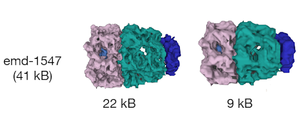
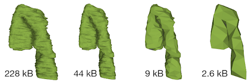
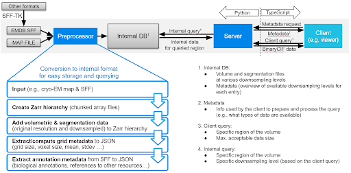

# Overview
## Why
Volume segmentation data are increasingly more available in public databases such as EMDB, EMPIAR, BioImage Archive, and the Image Data Resource, thus increasing the need for interactive web-based visualization of these data and their interpretation in a wider biological context. The integration and visualization of correlative and multimodal data is among the most significant challenges in modern biological imaging, and vital to furthering our understanding of biological systems across scales. To address this challenge, we developed Mol\* Volumes and Segmentations (Mol\*VS), which extends the scope of Mol\* Viewer to the cellular scale. 

## What
[Mol\*VS](https://molstarvolseg.ncbr.muni.cz/) is an open-source extension of [Mol\* Viewer](https://academic.oup.com/nar/article/49/W1/W431/6270780) dedicated to real-time visualization of large-scale volumetric data from cryo-EM, light microscopy, volume-EM, and other imaging experiments, as well as their segmentations and biological annotations. Mol\*VS pre-processes volumetric and segmentation data and delivers it to a dedicated Mol\* Viewer extension so that even very large datasets can be visualized in real time and alongside macromolecular structure data with residue and atomic-level information.

Mol\*VS has been running since September 2022 and provides seamless access to all [curated segmentation datasets available in EMDB and EMPIAR](https://www.ebi.ac.uk/empiar/volume-browser/). As availability of segmentation data remains scarce, we also provide a few entries derived from EMDB, BioImage Archive, and Image Data Resource datasets. Individual users and platforms providing access to cell imaging data can freely use a local instance of Mol\*VS.

## How
Mol\*VS has four major components, namely a preprocessing module, an internal database with preprocessed data, a server module that queries the internal database, and a client module that requests and interprets the data received so that it can be displayed.

Mol\*VS takes input in [EMDB-SFF](http://europepmc.org/article/MED/28682240) and segmentation formats converted to EMDB-SFF via the [EMDB-SFF Toolkit](https://sfftk.readthedocs.io/en/latest/) built into Mol\*VS. We also handle [3D map volumes from EM reconstruction](https://www.ebi.ac.uk/emdb/documentation) and added experimental support for [OME-NGFF](https://www.nature.com/articles/s41592-021-01326-w), focused on light microscopy. These formats were devised by international consortia following ongoing consultations with the scientific community, aiming to support the unification of storage and delivery of bioimaging data and metadata in an accessible, traceable, and scalable fashion.

First, Mol\*VS processes the volumetric and segmentation data into an internal format ([Zarr](https://zarr.readthedocs.io/en/stable/)). These pre-processed data are stored in the internal database in both original and downsampled forms, together with pre-computed statistics, metadata, and internal annotations for each data set. This step happens only when entries in the internal database need to be added/removed/changed.

Whenever data are requested by the client module, the server module performs a relevant query of the internal database and then packs and delivers the requested data to the client module, which then unpacks the data and feeds it to Mol\* Viewer. 

The pre-processing and data delivery approaches used by Mol\*VS are key to the ability to enable fast and interactive visualization in the web browser irrespective of the size of the original data set. Due to its perfect integration within the Mol\* ecosystem, Mol\*VS effectively enables web-based concomitant and interactive visualization of 3D volumes of cells, organelles, and molecules together with volume segmentations and their annotations, as well as 3D models of molecules fitted inside such volumes, together with their residue-level annotations and atomic-level information.
